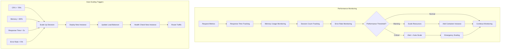
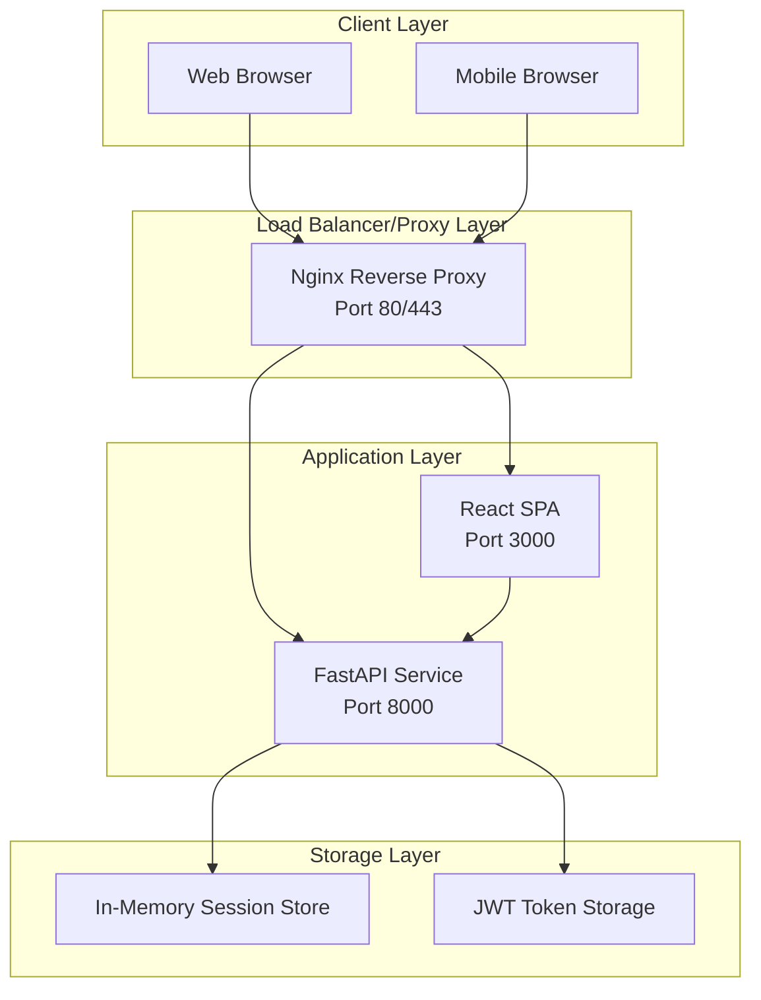
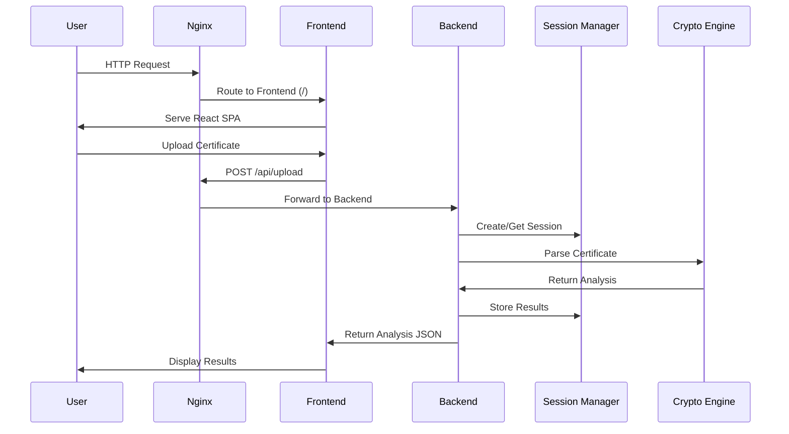
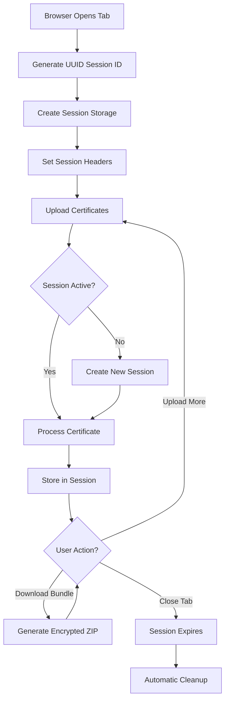
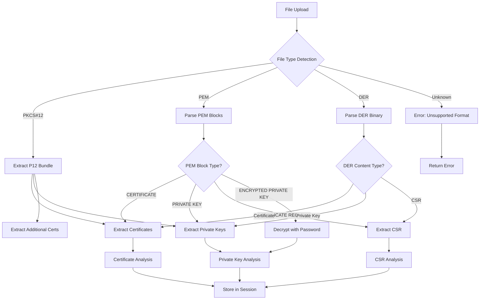
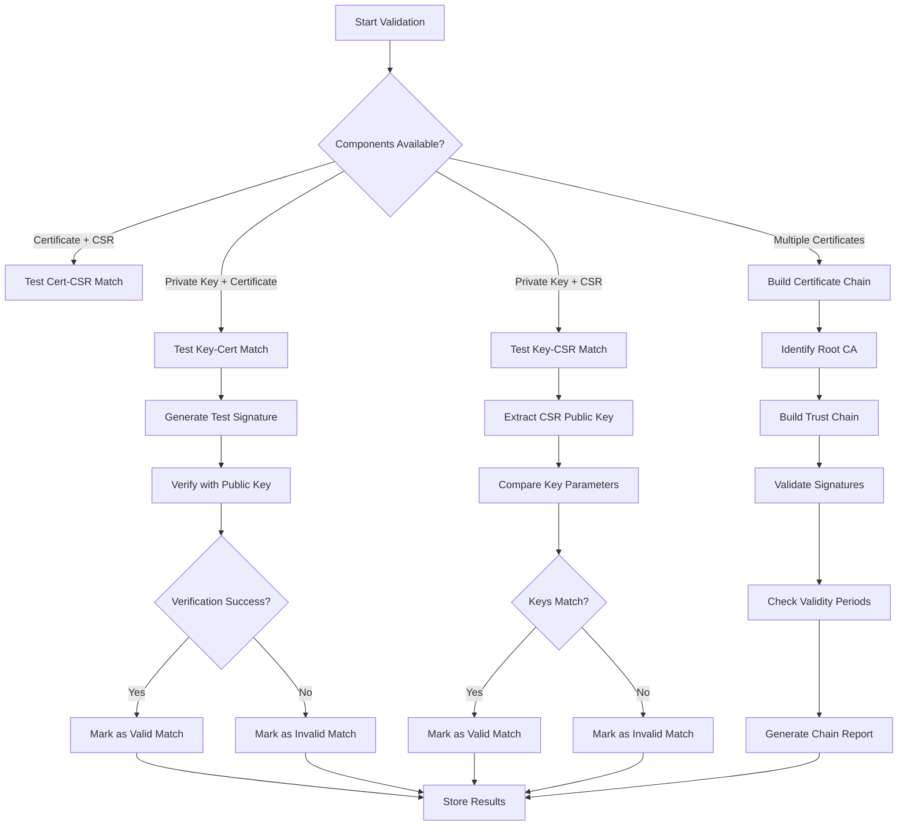
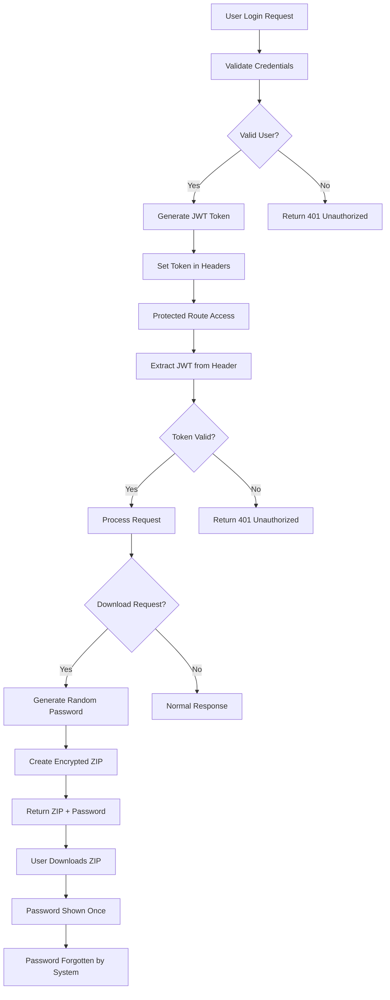
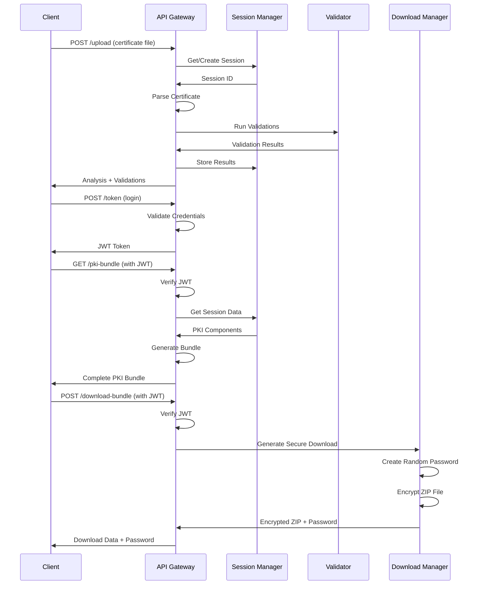
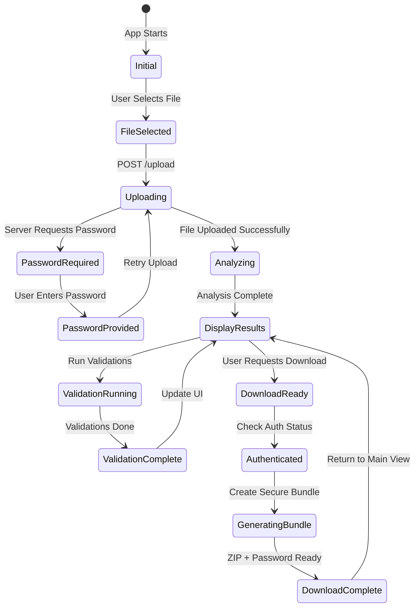

---

## Deployment Architecture

### Docker Compose Infrastructure

```yaml
# docker-compose.yml
version: '3.8'

services:
  nginx:
    build: ./nginx
    ports:
      - "80:80"
      - "443:443"
    depends_on:
      - frontend
      - backend-fastapi
    volumes:
      - ./nginx/ssl:/etc/nginx/ssl:ro  # SSL certificates for HTTPS
    networks:
      - certificate-network
    restart: unless-stopped

  frontend:
    build: ./frontend
    container_name: certificate-frontend
    expose:
      - "80"
    environment:
      - NODE_ENV=production
    networks:
      - certificate-network
    restart: unless-stopped

  backend-fastapi:
    build: ./backend-fastapi
    container_name: certificate-backend
    expose:
      - "8000"
    environment:
      - SECRET_KEY=${SECRET_KEY:-your-secret-key-change-in-production}
      - DEBUG=OFF
      - ACCESS_TOKEN_EXPIRE_MINUTES=30
      - MAX_FILE_SIZE=10485760  # 10MB
    networks:
      - certificate-network
    restart: unless-stopped
    healthcheck:
      test: ["CMD", "curl", "-f", "http://localhost:8000/health"]
      interval: 30s
      timeout: 10s
      retries: 3

networks:
  certificate-network:
    driver: bridge

volumes:
  ssl-certs:
    driver: local
```

### Nginx Configuration for Production

```nginx
# nginx/nginx.conf
upstream frontend {
    server frontend:80;
}

upstream backend {
    server backend-fastapi:8000;
}

server {
    listen 80;
    server_name your-domain.com;
    
    # Redirect HTTP to HTTPS
    return 301 https://$server_name$request_uri;
}

server {
    listen 443 ssl http2;
    server_name your-domain.com;
    
    # SSL Configuration
    ssl_certificate /etc/nginx/ssl/cert.pem;
    ssl_certificate_key /etc/nginx/ssl/key.pem;
    ssl_protocols TLSv1.2 TLSv1.3;
    ssl_ciphers ECDHE-RSA-AES256-GCM-SHA512:DHE-RSA-AES256-GCM-SHA512:ECDHE-RSA-AES256-GCM-SHA384:DHE-RSA-AES256-GCM-SHA384;
    ssl_prefer_server_ciphers off;
    ssl_session_cache shared:SSL:10m;
    
    # Security Headers
    add_header X-Frame-Options "SAMEORIGIN" always;
    add_header X-Content-Type-Options "nosniff" always;
    add_header X-XSS-Protection "1; mode=block" always;
    add_header Referrer-Policy "no-referrer-when-downgrade" always;
    add_header Content-Security-Policy "default-src 'self' http: https: data: blob: 'unsafe-inline'" always;
    
    # File Upload Limits
    client_max_body_size 10M;
    client_body_timeout 60s;
    client_header_timeout 60s;
    
    # API Proxy
    location /api/ {
        proxy_pass http://backend/;
        proxy_set_header Host $host;
        proxy_set_header X-Real-IP $remote_addr;
        proxy_set_header X-Forwarded-For $proxy_add_x_forwarded_for;
        proxy_set_header X-Forwarded-Proto $scheme;
        proxy_connect_timeout 60s;
        proxy_send_timeout 60s;
        proxy_read_timeout 60s;
    }
    
    # WebSocket Support (if needed for real-time features)
    location /ws/ {
        proxy_pass http://backend/ws/;
        proxy_http_version 1.1;
        proxy_set_header Upgrade $http_upgrade;
        proxy_set_header Connection "upgrade";
        proxy_set_header Host $host;
        proxy_set_header X-Real-IP $remote_addr;
    }
    
    # Frontend SPA
    location / {
        proxy_pass http://frontend;
        proxy_set_header Host $host;
        proxy_set_header X-Real-IP $remote_addr;
        proxy_set_header X-Forwarded-For $proxy_add_x_forwarded_for;
        proxy_set_header X-Forwarded-Proto $scheme;
        
        # SPA fallback
        try_files $uri $uri/ /index.html;
    }
    
    # Static assets caching
    location ~* \.(js|css|png|jpg|jpeg|gif|ico|svg)$ {
        expires 1y;
        add_header Cache-Control "public, immutable";
        proxy_pass http://frontend;
    }
}
```

### Container Health Monitoring

```python
# backend-fastapi/health.py
from fastapi import APIRouter
from datetime import datetime
import psutil
import os

health_router = APIRouter()

@health_router.get("/health")
async def health_check():
    """
    Comprehensive health check endpoint
    """
    try:
        # System metrics
        cpu_percent = psutil.cpu_percent()
        memory = psutil.virtual_memory()
        disk = psutil.disk_usage('/')
        
        # Application metrics
        uptime = datetime.utcnow() - app_start_time
        active_sessions = len(session_manager.sessions)
        
        health_status = {
            "status": "healthy",
            "timestamp": datetime.utcnow().isoformat(),
            "uptime_seconds": uptime.total_seconds(),
            "system": {
                "cpu_percent": cpu_percent,
                "memory_percent": memory.percent,
                "disk_percent": (disk.used / disk.total) * 100,
                "load_average": os.getloadavg() if hasattr(os, 'getloadavg') else None
            },
            "application": {
                "active_sessions": active_sessions,
                "version": "1.0.0",
                "environment": os.getenv("ENVIRONMENT", "development")
            }
        }
        
        # Determine overall health
        if cpu_percent > 90 or memory.percent > 90:
            health_status["status"] = "warning"
        
        if cpu_percent > 95 or memory.percent > 95:
            health_status["status"] = "unhealthy"
            
        return health_status
        
    except Exception as e:
        return {
            "status": "unhealthy",
            "timestamp": datetime.utcnow().isoformat(),
            "error": str(e)
        }
```

---

## Performance Considerations

### Memory Management Strategy

```python
# backend-fastapi/performance_manager.py
import gc
import threading
import time
from typing import Dict, Any
from datetime import datetime, timedelta

class PerformanceManager:
    
    def __init__(self):
        self.memory_threshold = 500 * 1024 * 1024  # 500MB
        self.cleanup_interval = 300  # 5 minutes
        self.performance_metrics = {
            'requests_per_second': 0,
            'average_response_time': 0,
            'memory_usage': 0,
            'active_sessions': 0
        }
        
        # Start background cleanup thread
        self.cleanup_thread = threading.Thread(target=self._cleanup_worker, daemon=True)
        self.cleanup_thread.start()
    
    def _cleanup_worker(self):
        """
        Background worker for memory cleanup and session management
        """
        while True:
            try:
                # Clean expired sessions
                self._cleanup_expired_sessions()
                
                # Force garbage collection if memory usage is high
                current_memory = psutil.Process().memory_info().rss
                if current_memory > self.memory_threshold:
                    gc.collect()
                    
                # Update performance metrics
                self._update_performance_metrics()
                
                time.sleep(self.cleanup_interval)
                
            except Exception as e:
                logger.error(f"Cleanup worker error: {str(e)}")
                time.sleep(60)  # Wait before retrying
    
    def _cleanup_expired_sessions(self):
        """
        Remove sessions that haven't been accessed recently
        """
        current_time = datetime.utcnow()
        expired_sessions = []
        
        for session_id, session_data in session_manager.sessions.items():
            last_accessed = session_data.get('last_accessed', current_time)
            if current_time - last_accessed > timedelta(minutes=30):
                expired_sessions.append(session_id)
        
        for session_id in expired_sessions:
            session_manager.delete_session(session_id)
            logger.info(f"Cleaned up expired session: {session_id}")
    
    def optimize_certificate_storage(self, session_data: Dict[str, Any]) -> Dict[str, Any]:
        """
        Optimize certificate storage to reduce memory footprint
        """
        optimized_data = {}
        
        for key, value in session_data.items():
            if key in ['certificates', 'private_keys', 'csrs']:
                # Store only essential data, remove large binary objects when not needed
                optimized_data[key] = {}
                for item_id, item_data in value.items():
                    optimized_item = {
                        'common_name': item_data.get('common_name'),
                        'serial_number': item_data.get('serial_number'),
                        'validity_period': item_data.get('validity_period'),
                        'issuer': item_data.get('issuer'),
                        'key_size': item_data.get('key_size'),
                        'signature_algorithm': item_data.get('signature_algorithm'),
                        'pem_content': item_data.get('pem_content')  # Keep PEM for downloads
                        # Remove 'crypto_object' to save memory when not actively validating
                    }
                    optimized_data[key][item_id] = optimized_item
            else:
                optimized_data[key] = value
        
        return optimized_data
```

### Caching Strategy Implementation

```python
# backend-fastapi/cache_manager.py
import hashlib
import json
from functools import wraps
from typing import Any, Callable, Optional
import time

class CacheManager:
    
    def __init__(self, max_size: int = 1000, ttl: int = 3600):
        self.cache = {}
        self.access_times = {}
        self.max_size = max_size
        self.ttl = ttl  # Time to live in seconds
    
    def cache_key(self, *args, **kwargs) -> str:
        """
        Generate cache key from function arguments
        """
        key_data = {
            'args': args,
            'kwargs': sorted(kwargs.items())
        }
        key_string = json.dumps(key_data, sort_keys=True, default=str)
        return hashlib.md5(key_string.encode()).hexdigest()
    
    def get(self, key: str) -> Optional[Any]:
        """
        Get cached value if it exists and hasn't expired
        """
        if key not in self.cache:
            return None
        
        # Check if expired
        if time.time() - self.access_times[key] > self.ttl:
            del self.cache[key]
            del self.access_times[key]
            return None
        
        # Update access time
        self.access_times[key] = time.time()
        return self.cache[key]
    
    def set(self, key: str, value: Any):
        """
        Store value in cache with LRU eviction
        """
        # Evict oldest if cache is full
        if len(self.cache) >= self.max_size:
            oldest_key = min(self.access_times, key=self.access_times.get)
            del self.cache[oldest_key]
            del self.access_times[oldest_key]
        
        self.cache[key] = value
        self.access_times[key] = time.time()
    
    def cached_validation(self, func: Callable) -> Callable:
        """
        Decorator for caching validation results
        """
        @wraps(func)
        def wrapper(*args, **kwargs):
            cache_key = self.cache_key(*args, **kwargs)
            cached_result = self.get(cache_key)
            
            if cached_result is not None:
                return cached_result
            
            result = func(*args, **kwargs)
            self.set(cache_key, result)
            return result
        
        return wrapper

# Usage example
cache_manager = CacheManager(max_size=500, ttl=1800)  # 30 minutes TTL

@cache_manager.cached_validation
def validate_certificate_chain(certificates: list) -> dict:
    """
    Expensive validation operation that benefits from caching
    """
    # Perform complex validation logic
    return validation_results
```

### Database Scaling Considerations

```python
# backend-fastapi/scaling_strategy.py
from typing import Dict, List, Any
import redis
import json
from datetime import datetime, timedelta

class ScalingStrategy:
    """
    Strategy for scaling beyond single-instance deployment
    """
    
    def __init__(self, redis_url: str = None):
        self.redis_client = redis.Redis.from_url(redis_url) if redis_url else None
        self.local_cache = {}
    
    def distributed_session_storage(self, session_id: str, data: Dict[str, Any]):
        """
        Store session data in Redis for multi-instance deployment
        """
        if self.redis_client:
            # Serialize complex objects for Redis storage
            serializable_data = self._make_serializable(data)
            self.redis_client.setex(
                f"session:{session_id}",
                timedelta(minutes=30),
                json.dumps(serializable_data)
            )
        else:
            # Fallback to local storage
            self.local_cache[session_id] = data
    
    def get_distributed_session(self, session_id: str) -> Dict[str, Any]:
        """
        Retrieve session data from distributed storage
        """
        if self.redis_client:
            data = self.redis_client.get(f"session:{session_id}")
            if data:
                return json.loads(data)
        else:
            return self.local_cache.get(session_id)
        
        return None
    
    def _make_serializable(self, data: Dict[str, Any]) -> Dict[str, Any]:
        """
        Convert complex objects to JSON-serializable format
        """
        serializable = {}
        
        for key, value in data.items():
            if key in ['certificates', 'private_keys', 'csrs']:
                serializable[key] = {}
                for item_id, item_data in value.items():
                    # Store only JSON-serializable data
                    serializable[key][item_id] = {
                        k: v for k, v in item_data.items() 
                        if k != 'crypto_object'  # Exclude cryptography objects
                    }
            else:
                serializable[key] = value
        
        return serializable
    
    def load_balancing_strategy(self) -> Dict[str, Any]:
        """
        Configuration for load balancing multiple instances
        """
        return {
            "strategy": "round_robin",
            "health_check_interval": 30,
            "max_connections_per_instance": 100,
            "session_affinity": False,  # Use distributed sessions
            "auto_scaling": {
                "min_instances": 2,
                "max_instances": 10,
                "cpu_threshold": 70,
                "memory_threshold": 80
            }
        }
```

### Performance Monitoring



---

## Monitoring and Observability

### Logging Strategy

```python
# backend-fastapi/logging_config.py
import logging
import json
from datetime import datetime
from typing import Any, Dict

class StructuredLogger:
    
    def __init__(self, name: str):
        self.logger = logging.getLogger(name)
        self.logger.setLevel(logging.INFO)
        
        # Create structured formatter
        handler = logging.StreamHandler()
        formatter = logging.Formatter(
            '%(asctime)s - %(name)s - %(levelname)s - %(message)s'
        )
        handler.setFormatter(formatter)
        self.logger.addHandler(handler)
    
    def log_certificate_analysis(self, session_id: str, filename: str, 
                                analysis_result: Dict[str, Any]):
        """
        Log certificate analysis with structured data
        """
        log_data = {
            "event": "certificate_analysis",
            "session_id": session_id,
            "filename": filename,
            "timestamp": datetime.utcnow().isoformat(),
            "certificates_found": len(analysis_result.get('certificates', [])),
            "private_keys_found": len(analysis_result.get('private_keys', [])),
            "csrs_found": len(analysis_result.get('csrs', [])),
            "format_detected": analysis_result.get('format_detected'),
            "has_errors": len(analysis_result.get('errors', [])) > 0
        }
        
        self.logger.info(json.dumps(log_data))
    
    def log_validation_results(self, session_id: str, validation_results: Dict[str, Any]):
        """
        Log validation results for monitoring
        """
        log_data = {
            "event": "validation_completed",
            "session_id": session_id,
            "timestamp": datetime.utcnow().isoformat(),
            "validations": {
                "key_cert_matches": len(validation_results.get('private_key_certificate_matches', [])),
                "chain_validations": len(validation_results.get('certificate_chain_validations', [])),
                "total_valid": sum(1 for v in validation_results.get('private_key_certificate_matches', []) if v['is_valid'])
            }
        }
        
        self.logger.info(json.dumps(log_data))
    
    def log_security_event(self, event_type: str, session_id: str, details: Dict[str, Any]):
        """
        Log security-related events
        """
        log_data = {
            "event": "security_event",
            "event_type": event_type,
            "session_id": session_id,
            "timestamp": datetime.utcnow().isoformat(),
            "details": details
        }
        
        self.logger.warning(json.dumps(log_data))

# Usage throughout the application
logger = StructuredLogger("certificate_analysis")
```

### Metrics Collection

```python
# backend-fastapi/metrics.py
from prometheus_client import Counter, Histogram, Gauge, start_http_server
import time
from functools import wraps

# Define metrics
REQUEST_COUNT = Counter('certificate_analysis_requests_total', 
                       'Total requests', ['method', 'endpoint'])
REQUEST_LATENCY = Histogram('certificate_analysis_request_duration_seconds',
                           'Request latency')
ACTIVE_SESSIONS = Gauge('certificate_analysis_active_sessions',
                       'Number of active sessions')
CERTIFICATE_UPLOADS = Counter('certificate_uploads_total',
                             'Total certificate uploads', ['format'])

def track_performance(func):
    """
    Decorator to track API performance metrics
    """
    @wraps(func)
    async def wrapper(*args, **kwargs):
        start_time = time.time()
        
        try:
            result = await func(*args, **kwargs)
            REQUEST_COUNT.labels(method='POST', endpoint=func.__name__).inc()
            return result
        except Exception as e:
            REQUEST_COUNT.labels(method='POST', endpoint=f"{func.__name__}_error").inc()
            raise
        finally:
            REQUEST_LATENCY.observe(time.time() - start_time)
    
    return wrapper

# Start metrics server
def start_metrics_server(port: int = 8001):
    start_http_server(port)
```

This comprehensive technical documentation covers all major aspects of the Certificate Analysis Tool, including:

1. **System Architecture** - High-level design and component interaction
2. **Session Management** - UUID-based isolation with thread safety
3. **Certificate Processing** - Multi-format parsing pipeline
4. **Cryptographic Validation** - Comprehensive validation engine
5. **Security Implementation** - JWT auth and encrypted downloads
6. **API Design** - RESTful endpoints with detailed examples
7. **Frontend Architecture** - React components and state management
8. **Data Flow** - Complete system data flow diagrams
9. **Deployment Architecture** - Docker, Nginx, and production setup
10. **Performance Considerations** - Memory management, caching, and scaling
11. **Monitoring** - Logging, metrics, and observability

The documentation includes detailed code snippets, Mermaid diagrams, and flowcharts that show exactly how each component works and how data flows through the system. This should give developers a complete understanding of the implementation and help with maintenance, scaling, and further development.# Technical Documentation - Certificate Analysis Tool

## Table of Contents

1. [System Architecture](#system-architecture)
2. [Session Management](#session-management)
3. [Certificate Processing Pipeline](#certificate-processing-pipeline)
4. [Cryptographic Validation Engine](#cryptographic-validation-engine)
5. [Security Implementation](#security-implementation)
6. [API Design](#api-design)
7. [Frontend Architecture](#frontend-architecture)
8. [Data Flow](#data-flow)
9. [Deployment Architecture](#deployment-architecture)
10. [Performance Considerations](#performance-considerations)

---

## System Architecture

### High-Level Architecture Overview



### Component Interaction Flow



---

## Session Management

### Session Architecture

The session management system provides multi-user isolation with automatic cleanup and thread safety.

```python
# backend-fastapi/session_manager.py
import uuid
import threading
import time
from typing import Dict, Any, Optional
from datetime import datetime, timedelta

class SessionManager:
    def __init__(self, cleanup_interval: int = 300, session_timeout: int = 1800):
        self.sessions: Dict[str, Dict[str, Any]] = {}
        self.session_locks: Dict[str, threading.Lock] = {}
        self.global_lock = threading.Lock()
        self.cleanup_interval = cleanup_interval
        self.session_timeout = session_timeout
        self.last_cleanup = time.time()
    
    def create_session(self) -> str:
        """Create a new session with UUID isolation"""
        session_id = str(uuid.uuid4())
        
        with self.global_lock:
            self.sessions[session_id] = {
                'certificates': {},
                'private_keys': {},
                'csrs': {},
                'pkcs12_bundles': {},
                'created_at': datetime.utcnow(),
                'last_accessed': datetime.utcnow(),
                'validation_results': {}
            }
            self.session_locks[session_id] = threading.Lock()
        
        return session_id
    
    def get_session_data(self, session_id: str) -> Optional[Dict[str, Any]]:
        """Thread-safe session data retrieval"""
        if session_id not in self.sessions:
            return None
            
        with self.session_locks[session_id]:
            self.sessions[session_id]['last_accessed'] = datetime.utcnow()
            return self.sessions[session_id].copy()
```

### Session Lifecycle Flow



---

## Certificate Processing Pipeline

### Multi-Format Certificate Parser

```python
# backend-fastapi/certificate_analyzer.py
from cryptography import x509
from cryptography.hazmat.primitives import serialization
from cryptography.hazmat.primitives.serialization import pkcs12
import base64

class CertificateAnalyzer:
    
    @staticmethod
    def parse_certificate_file(file_content: bytes, password: str = None) -> Dict[str, Any]:
        """
        Universal certificate parser supporting multiple formats
        """
        results = {
            'certificates': [],
            'private_keys': [],
            'csrs': [],
            'format_detected': None,
            'errors': []
        }
        
        # Try PKCS#12 first (if password provided)
        if password:
            try:
                private_key, certificate, additional_certificates = pkcs12.load_key_and_certificates(
                    file_content, password.encode('utf-8')
                )
                results['format_detected'] = 'PKCS#12'
                
                if certificate:
                    results['certificates'].append(CertificateAnalyzer._analyze_certificate(certificate))
                if private_key:
                    results['private_keys'].append(CertificateAnalyzer._analyze_private_key(private_key))
                if additional_certificates:
                    for cert in additional_certificates:
                        results['certificates'].append(CertificateAnalyzer._analyze_certificate(cert))
                        
                return results
            except Exception as e:
                results['errors'].append(f"PKCS#12 parsing failed: {str(e)}")
        
        # Try PEM format
        try:
            pem_content = file_content.decode('utf-8')
            results.update(CertificateAnalyzer._parse_pem_content(pem_content))
            if results['certificates'] or results['private_keys'] or results['csrs']:
                results['format_detected'] = 'PEM'
                return results
        except UnicodeDecodeError:
            pass
        
        # Try DER format
        try:
            # Try as certificate
            cert = x509.load_der_x509_certificate(file_content)
            results['certificates'].append(CertificateAnalyzer._analyze_certificate(cert))
            results['format_detected'] = 'DER'
            return results
        except Exception:
            pass
            
        # Try as private key (DER)
        try:
            private_key = serialization.load_der_private_key(file_content, password=None)
            results['private_keys'].append(CertificateAnalyzer._analyze_private_key(private_key))
            results['format_detected'] = 'DER'
            return results
        except Exception:
            pass
        
        results['errors'].append("Unable to parse file - unsupported format")
        return results
```

### Certificate Analysis Flow



---

## Cryptographic Validation Engine

### Validation Matrix Implementation

```python
# backend-fastapi/validation_engine.py
from cryptography.hazmat.primitives import hashes
from cryptography.hazmat.primitives.asymmetric import rsa, ec, ed25519
import hashlib

class CryptographicValidator:
    
    def __init__(self, session_data: Dict[str, Any]):
        self.session_data = session_data
        self.validation_matrix = {}
    
    def run_comprehensive_validation(self) -> Dict[str, Any]:
        """
        Performs all possible validation combinations
        """
        validations = {
            'private_key_certificate_matches': [],
            'private_key_csr_matches': [],
            'certificate_csr_matches': [],
            'certificate_chain_validations': [],
            'signature_validations': [],
            'trust_chain_validations': []
        }
        
        # Private Key <-> Certificate matching
        for key_id, private_key in self.session_data['private_keys'].items():
            for cert_id, certificate in self.session_data['certificates'].items():
                validation_result = self._validate_key_certificate_match(
                    private_key['crypto_object'], 
                    certificate['crypto_object']
                )
                validations['private_key_certificate_matches'].append({
                    'private_key_id': key_id,
                    'certificate_id': cert_id,
                    'is_valid': validation_result['is_valid'],
                    'details': validation_result['details']
                })
        
        # Certificate Chain Validation
        chain_validation = self._build_and_validate_certificate_chain()
        validations['certificate_chain_validations'] = chain_validation
        
        return validations
    
    def _validate_key_certificate_match(self, private_key, certificate) -> Dict[str, Any]:
        """
        Validates if a private key matches a certificate's public key
        """
        try:
            # Extract public key from certificate
            cert_public_key = certificate.public_key()
            
            # Generate a test signature with private key
            test_data = b"certificate_validation_test_data"
            
            if isinstance(private_key, (rsa.RSAPrivateKey, ec.EllipticCurvePrivateKey)):
                # Sign test data
                signature = private_key.sign(
                    test_data,
                    hashes.SHA256() if isinstance(private_key, rsa.RSAPrivateKey) else ec.ECDSA(hashes.SHA256())
                )
                
                # Verify with certificate's public key
                if isinstance(cert_public_key, rsa.RSAPublicKey):
                    cert_public_key.verify(signature, test_data, hashes.SHA256())
                elif isinstance(cert_public_key, ec.EllipticCurvePublicKey):
                    cert_public_key.verify(signature, test_data, ec.ECDSA(hashes.SHA256()))
                
                return {
                    'is_valid': True,
                    'details': 'Private key successfully matches certificate public key',
                    'algorithm': type(private_key).__name__
                }
                
        except Exception as e:
            return {
                'is_valid': False,
                'details': f'Key-certificate mismatch: {str(e)}',
                'algorithm': type(private_key).__name__ if private_key else 'Unknown'
            }
```

### Validation Flow Diagram



---

## Security Implementation

### JWT Authentication System

```python
# backend-fastapi/auth.py
from datetime import datetime, timedelta
from jose import JWTError, jwt
from passlib.context import CryptContext
from fastapi import HTTPException, status

class AuthenticationManager:
    
    def __init__(self, secret_key: str, algorithm: str = "HS256"):
        self.secret_key = secret_key
        self.algorithm = algorithm
        self.pwd_context = CryptContext(schemes=["bcrypt"], deprecated="auto")
        self.access_token_expire_minutes = 30
    
    def create_access_token(self, data: dict, expires_delta: timedelta = None):
        """
        Create JWT access token with expiration
        """
        to_encode = data.copy()
        if expires_delta:
            expire = datetime.utcnow() + expires_delta
        else:
            expire = datetime.utcnow() + timedelta(minutes=15)
        
        to_encode.update({"exp": expire})
        encoded_jwt = jwt.encode(to_encode, self.secret_key, algorithm=self.algorithm)
        return encoded_jwt
    
    def verify_token(self, token: str):
        """
        Verify and decode JWT token
        """
        try:
            payload = jwt.decode(token, self.secret_key, algorithms=[self.algorithm])
            username: str = payload.get("sub")
            if username is None:
                raise HTTPException(
                    status_code=status.HTTP_401_UNAUTHORIZED,
                    detail="Could not validate credentials"
                )
            return username
        except JWTError:
            raise HTTPException(
                status_code=status.HTTP_401_UNAUTHORIZED,
                detail="Could not validate credentials"
            )
```

### Encrypted ZIP Download Implementation

```python
# backend-fastapi/secure_download.py
import zipfile
import secrets
import string
from io import BytesIO
from cryptography.fernet import Fernet
import base64

class SecureDownloadManager:
    
    @staticmethod
    def generate_secure_password(length: int = 16) -> str:
        """
        Generate cryptographically secure random password
        """
        alphabet = string.ascii_letters + string.digits + "!@#$%^&*"
        password = ''.join(secrets.choice(alphabet) for _ in range(length))
        return password
    
    @staticmethod
    def create_encrypted_zip(files_data: Dict[str, str], password: str) -> bytes:
        """
        Create password-protected ZIP file with certificate bundle
        """
        zip_buffer = BytesIO()
        
        with zipfile.ZipFile(zip_buffer, 'w', zipfile.ZIP_DEFLATED) as zip_file:
            # Set password for the ZIP file
            zip_file.setpassword(password.encode('utf-8'))
            
            for filename, content in files_data.items():
                # Add each file to the encrypted ZIP
                zip_file.writestr(filename, content, compress_type=zipfile.ZIP_DEFLATED)
        
        zip_buffer.seek(0)
        return zip_buffer.getvalue()
    
    @staticmethod
    def prepare_pki_bundle(session_data: Dict[str, Any]) -> Dict[str, str]:
        """
        Prepare complete PKI bundle for download
        """
        bundle_files = {}
        
        # Add certificates in proper order (Root -> Intermediate -> End Entity)
        cert_chain = SecureDownloadManager._order_certificate_chain(
            session_data['certificates']
        )
        
        for i, cert_data in enumerate(cert_chain):
            role = cert_data.get('role', 'unknown')
            filename = f"{i+1:02d}_{role}_{cert_data['common_name']}.crt"
            bundle_files[filename] = cert_data['pem_content']
        
        # Add private keys
        for key_id, key_data in session_data['private_keys'].items():
            filename = f"private_key_{key_data['key_type'].lower()}.key"
            bundle_files[filename] = key_data['pem_content']
        
        # Add CSRs
        for csr_id, csr_data in session_data['csrs'].items():
            filename = f"certificate_request_{csr_data['common_name']}.csr"
            bundle_files[filename] = csr_data['pem_content']
        
        # Add README with deployment instructions
        bundle_files['README.txt'] = SecureDownloadManager._generate_deployment_readme(
            session_data
        )
        
        return bundle_files
```

### Security Architecture Flow



---

## API Design

### RESTful Endpoint Structure

```python
# backend-fastapi/main.py
from fastapi import FastAPI, UploadFile, Depends, HTTPException
from fastapi.security import HTTPBearer

app = FastAPI(
    title="Certificate Analysis API",
    description="Comprehensive PKI analysis and management",
    version="1.0.0"
)

security = HTTPBearer()

@app.post("/upload")
async def upload_certificate(
    file: UploadFile,
    password: str = None,
    session_id: str = Depends(get_or_create_session)
):
    """
    Upload and analyze certificate files
    
    Supported formats:
    - PEM (.pem, .crt, .cer)
    - DER (.der)
    - PKCS#12 (.p12, .pfx)
    - Private Keys (.key)
    - Certificate Requests (.csr)
    """
    try:
        # Validate file size
        if file.size > MAX_FILE_SIZE:
            raise HTTPException(400, "File too large")
        
        # Read file content
        content = await file.read()
        
        # Analyze certificate
        analyzer = CertificateAnalyzer()
        results = analyzer.parse_certificate_file(content, password)
        
        # Store in session
        session_manager.store_analysis_results(session_id, file.filename, results)
        
        # Run validations
        validator = CryptographicValidator(
            session_manager.get_session_data(session_id)
        )
        validation_results = validator.run_comprehensive_validation()
        
        return {
            "analysis": results,
            "validations": validation_results,
            "session_id": session_id
        }
        
    except Exception as e:
        raise HTTPException(500, f"Analysis failed: {str(e)}")

@app.get("/pki-bundle")
async def get_pki_bundle(
    session_id: str = Depends(get_session_id),
    token: str = Depends(security)
):
    """
    Get complete PKI bundle (Protected endpoint)
    """
    # Verify JWT token
    auth_manager.verify_token(token.credentials)
    
    session_data = session_manager.get_session_data(session_id)
    if not session_data:
        raise HTTPException(404, "Session not found")
    
    # Generate ordered PKI bundle
    bundle_generator = PKIBundleGenerator(session_data)
    pki_bundle = bundle_generator.generate_complete_bundle()
    
    return {
        "pki_bundle": pki_bundle,
        "certificate_count": len(session_data['certificates']),
        "chain_valid": bundle_generator.is_chain_valid()
    }

@app.post("/download-bundle")
async def download_secure_bundle(
    session_id: str = Depends(get_session_id),
    token: str = Depends(security)
):
    """
    Download encrypted PKI bundle (Protected endpoint)
    """
    # Verify JWT token
    auth_manager.verify_token(token.credentials)
    
    session_data = session_manager.get_session_data(session_id)
    if not session_data:
        raise HTTPException(404, "Session not found")
    
    # Generate secure download
    download_manager = SecureDownloadManager()
    
    # Prepare bundle files
    bundle_files = download_manager.prepare_pki_bundle(session_data)
    
    # Generate random password
    zip_password = download_manager.generate_secure_password()
    
    # Create encrypted ZIP
    encrypted_zip = download_manager.create_encrypted_zip(bundle_files, zip_password)
    
    # Generate filename with timestamp
    timestamp = datetime.now().strftime("%Y%m%d-%H%M%S")
    filename = f"certificate-bundle-{timestamp}.zip"
    
    return {
        "zip_data": base64.b64encode(encrypted_zip).decode('utf-8'),
        "password": zip_password,
        "filename": filename,
        "file_count": len(bundle_files)
    }
```

### API Flow Diagram



---

## Frontend Architecture

### React Component Structure

```jsx
// frontend/src/contexts/CertificateContext.jsx
import React, { createContext, useContext, useReducer } from 'react'

const CertificateContext = createContext()

const certificateReducer = (state, action) => {
  switch (action.type) {
    case 'ADD_CERTIFICATE':
      return {
        ...state,
        certificates: {
          ...state.certificates,
          [action.payload.id]: action.payload
        }
      }
    
    case 'UPDATE_VALIDATIONS':
      return {
        ...state,
        validations: action.payload
      }
    
    case 'CLEAR_SESSION':
      return {
        certificates: {},
        validations: {},
        sessionId: null
      }
    
    default:
      return state
  }
}

export const CertificateProvider = ({ children }) => {
  const [state, dispatch] = useReducer(certificateReducer, {
    certificates: {},
    validations: {},
    sessionId: null
  })
  
  return (
    <CertificateContext.Provider value={{ state, dispatch }}>
      {children}
    </CertificateContext.Provider>
  )
}

export const useCertificates = () => {
  const context = useContext(CertificateContext)
  if (!context) {
    throw new Error('useCertificates must be used within CertificateProvider')
  }
  return context
}
```

### File Upload Component with Progress

```jsx
// frontend/src/components/FileUpload/FileUpload.jsx
import React, { useState, useCallback } from 'react'
import { useDropzone } from 'react-dropzone'
import api from '../../services/api'

const FileUpload = ({ onUploadSuccess }) => {
  const [uploadProgress, setUploadProgress] = useState({})
  const [passwordPrompt, setPasswordPrompt] = useState(null)
  
  const onDrop = useCallback(async (acceptedFiles) => {
    for (const file of acceptedFiles) {
      await handleFileUpload(file)
    }
  }, [])
  
  const handleFileUpload = async (file, password = null) => {
    const fileId = Date.now() + Math.random()
    
    // Initialize progress tracking
    setUploadProgress(prev => ({
      ...prev,
      [fileId]: { progress: 0, status: 'uploading' }
    }))
    
    try {
      const formData = new FormData()
      formData.append('file', file)
      if (password) {
        formData.append('password', password)
      }
      
      const response = await api.post('/upload', formData, {
        headers: {
          'Content-Type': 'multipart/form-data'
        },
        onUploadProgress: (progressEvent) => {
          const progress = Math.round(
            (progressEvent.loaded * 100) / progressEvent.total
          )
          setUploadProgress(prev => ({
            ...prev,
            [fileId]: { progress, status: 'uploading' }
          }))
        }
      })
      
      // Success
      setUploadProgress(prev => ({
        ...prev,
        [fileId]: { progress: 100, status: 'success' }
      }))
      
      onUploadSuccess(response.data)
      
    } catch (error) {
      if (error.response?.data?.detail?.includes('password')) {
        // Prompt for password
        setPasswordPrompt({ file, fileId })
      } else {
        // Upload failed
        setUploadProgress(prev => ({
          ...prev,
          [fileId]: { progress: 0, status: 'error', error: error.message }
        }))
      }
    }
  }
  
  const { getRootProps, getInputProps, isDragActive } = useDropzone({
    onDrop,
    accept: {
      'application/x-pem-file': ['.pem'],
      'application/x-x509-ca-cert': ['.crt', '.cer'],
      'application/x-pkcs12': ['.p12', '.pfx'],
      'application/pkcs8': ['.key'],
      'application/pkcs10': ['.csr']
    }
  })
  
  return (
    <div className="upload-container">
      <div 
        {...getRootProps()} 
        className={`dropzone ${isDragActive ? 'active' : ''}`}
      >
        <input {...getInputProps()} />
        {isDragActive ? (
          <p>Drop the certificate files here...</p>
        ) : (
          <p>Drag & drop certificate files here, or click to select</p>
        )}
      </div>
      
      {/* Upload Progress Display */}
      {Object.entries(uploadProgress).map(([fileId, progress]) => (
        <UploadProgressBar key={fileId} progress={progress} />
      ))}
      
      {/* Password Prompt Modal */}
      {passwordPrompt && (
        <PasswordPrompt
          onSubmit={(password) => {
            handleFileUpload(passwordPrompt.file, password)
            setPasswordPrompt(null)
          }}
          onCancel={() => setPasswordPrompt(null)}
        />
      )}
    </div>
  )
}
```

### Frontend State Flow



---

## Data Flow

### Complete System Data Flow

```mermaid
flowchart TD
    subgraph "Client Side"
        A[User Uploads File] --> B[React File Upload Component]
        B --> C[FormData with File + Password]
    end
    
    subgraph "Network Layer"
        C --> D[HTTP POST to /upload]
        D --> E[Nginx Reverse Proxy]
        E --> F[FastAPI Backend]
    end
    
    subgraph "Backend Processing"
        F --> G[Session Manager]
        G --> H{Session Exists?}
        H -->|No| I[Create New Session]
        H -->|Yes| J[Use Existing Session]
        I --> K[Certificate Analyzer]
        J --> K
        K --> L[Multi-Format Parser]
        L --> M[Cryptographic Validator]
        M --> N[Store Results in Session]
    end
    
    subgraph "Response Flow"
        N --> O[JSON Response]
        O --> P[Nginx Proxy Response]
        P --> Q[React State Update]
        Q --> R[UI Components Re-render]
        R --> S[Display Certificate Details]
        S --> T[Show Validation Results]
    end
    
    subgraph "Download Flow"
        T --> U{User Requests Download?}
        U -->|Yes| V[JWT Authentication Check]
        V --> W[Generate Random Password]
        W --> X[Create Encrypted ZIP]
        X --> Y[Base64 Encode ZIP]
        Y --> Z[Return ZIP + Password]
        Z --> AA[Client Downloads ZIP]
        AA --> BB[Password Displayed Once]
        BB --> CC[System Forgets Password]
    end