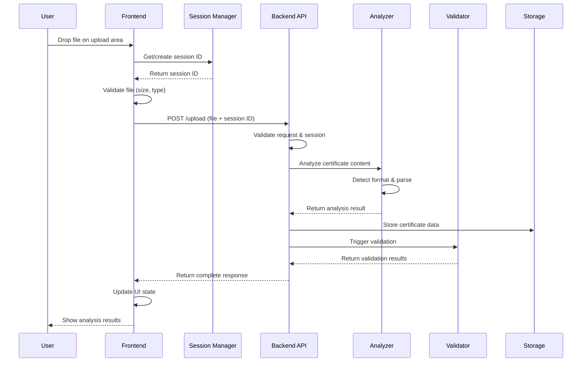
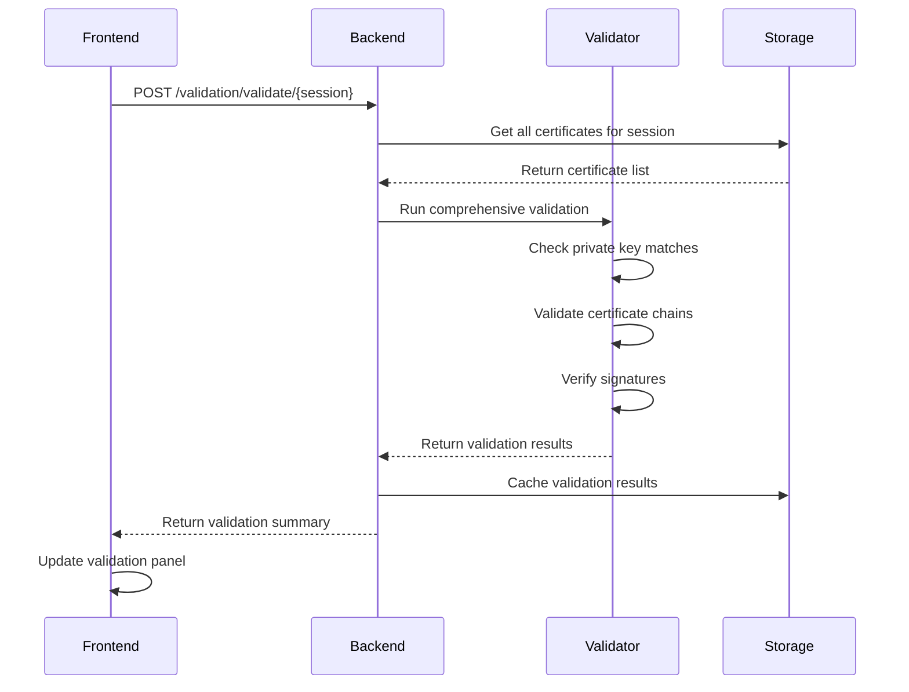

# Technical Documentation - Certificate Analysis Tool

This document provides detailed technical information about the implementation, architecture, and internal workings of the Certificate Analysis Tool.

## Table of Contents

- [System Architecture](#system-architecture)
- [Session Management](#session-management)
- [Certificate Processing Pipeline](#certificate-processing-pipeline)
- [Cryptographic Validation](#cryptographic-validation)
- [Security Implementation](#security-implementation)
- [API Design](#api-design)
- [Frontend Architecture](#frontend-architecture)
- [Data Flow](#data-flow)
- [Performance Considerations](#performance-considerations)

## System Architecture

### Overview

The application follows a **microservices-inspired architecture** with clear separation between frontend and backend, designed for scalability and maintainability.

```
┌─────────────────┐    HTTP/REST    ┌─────────────────┐
│   React SPA     │◄──────────────► │   FastAPI       │
│   (Frontend)    │    JSON/JWT     │   (Backend)     │
└─────────────────┘                 └─────────────────┘
         │                                   │
         ├── Session Manager                 ├── Session Manager
         ├── File Upload                     ├── Certificate Analyzer  
         ├── Validation UI                   ├── Cryptographic Engine
         └── PKI Visualization               └── In-Memory Storage
```

### Technology Stack Deep Dive

#### Backend Stack
- **FastAPI**: ASGI-based framework chosen for async capabilities and automatic OpenAPI generation
- **Pydantic**: Data validation and serialization with type hints
- **cryptography**: Industry-standard Python cryptographic library
- **python-jose**: JWT token handling with multiple algorithm support
- **passlib**: Password hashing with bcrypt for security
- **uvicorn**: High-performance ASGI server

#### Frontend Stack  
- **React 18**: Modern React with hooks and functional components
- **Vite**: Fast build tool with HMR and optimized bundling
- **Axios**: HTTP client with interceptors for authentication
- **Lucide React**: Consistent icon system
- **CSS Modules**: Scoped styling with component isolation

## Session Management

### Backend Session Management

The session management system provides **multi-user isolation** with automatic cleanup and thread safety.

#### SessionManager Class Implementation

```python
class SessionManager:
    """Manages per-session certificate storage and lifecycle"""
    
    # Class-level storage for all sessions
    _sessions: Dict[str, Dict[str, Any]] = {}
    _last_activity: Dict[str, datetime] = {}
    _lock = threading.RLock()  # Reentrant lock for thread safety
```

#### Session Data Structure

Each session maintains isolated storage:

```python
session_data = {
    "certificates": [],          # List of uploaded certificates
    "crypto_objects": {},        # Cryptographic objects by cert_id
    "pki_bundle": None,         # Generated PKI bundle
    "validation_results": {},    # Cached validation results
    "metadata": {               # Session metadata
        "created_at": datetime.now(),
        "user_agent": request_headers.get("user-agent"),
        "ip_address": client_ip
    }
}
```

#### Thread Safety Implementation

```python
@staticmethod
def get_or_create_session(session_id: str) -> Dict[str, Any]:
    """Thread-safe session retrieval with automatic cleanup"""
    with SessionManager._lock:
        current_time = datetime.now()
        
        # Update activity tracking
        SessionManager._last_activity[session_id] = current_time
        
        if session_id not in SessionManager._sessions:
            # Create new session with security measures
            session_data = SessionManager._create_session_structure()
            SessionManager._sessions[session_id] = session_data
            
        # Trigger background cleanup if needed
        SessionManager._cleanup_expired_sessions(current_time)
        
        return SessionManager._sessions[session_id]
```

#### Automatic Cleanup Mechanism

```python
@staticmethod
def _cleanup_expired_sessions(current_time: datetime) -> None:
    """Remove expired sessions to prevent memory leaks"""
    expired_sessions = []
    
    for session_id, last_activity in SessionManager._last_activity.items():
        if current_time - last_activity > timedelta(hours=1):  # Configurable timeout
            expired_sessions.append(session_id)
    
    for session_id in expired_sessions:
        SessionManager._sessions.pop(session_id, None)
        SessionManager._last_activity.pop(session_id, None)
        logger.info(f"Cleaned up expired session: {session_id}")
```

### Frontend Session Management

The frontend implements **per-tab session isolation** using `sessionStorage`:

#### SessionManager Class (Frontend)

```javascript
class SessionManager {
    constructor() {
        if (!this.isSessionStorageAvailable()) {
            console.warn('SessionStorage not available, using memory fallback')
            this.memoryStorage = new Map()
        }
        this.sessionId = this.getOrCreateSessionId()
        this.initializeSession()
    }
    
    generateUUID() {
        // RFC 4122 version 4 UUID implementation
        return 'xxxxxxxx-xxxx-4xxx-yxxx-xxxxxxxxxxxx'.replace(/[xy]/g, function(c) {
            const r = Math.random() * 16 | 0
            const v = c === 'x' ? r : (r & 0x3 | 0x8)
            return v.toString(16)
        })
    }
}
```

#### Session Persistence Strategy

```javascript
getOrCreateSessionId() {
    let sessionId = this.getStorageItem('certificate_session_id')
    
    if (!sessionId || !this.isValidUUID(sessionId)) {
        // Generate new session ID
        sessionId = this.generateUUID()
        this.setStorageItem('certificate_session_id', sessionId)
        this.setStorageItem('certificate_session_created', new Date().toISOString())
    }
    
    return sessionId
}
```

## Certificate Processing Pipeline

### File Upload and Initial Processing

#### 1. File Reception and Validation

```python
@router.post("/upload")
async def upload_certificate(
    session_id: str = Depends(get_session_id),
    file: UploadFile = File(...),
    password: Optional[str] = Form(None)
):
    # Validate file size and extension
    if file.size > settings.MAX_FILE_SIZE:
        raise HTTPException(400, "File too large")
    
    if not _is_allowed_file(file.filename):
        raise HTTPException(400, "Unsupported file format")
    
    # Read file content
    content = await file.read()
    
    # Process through analyzer
    result = analyzer.analyze_certificate(content, file.filename, password)
    
    return result
```

#### 2. Format Detection and Parsing

The analyzer implements **intelligent format detection**:

```python  
def analyze_certificate(self, content: bytes, filename: str, password: str = None) -> Dict:
    """Multi-format certificate analysis with automatic detection"""
    
    # Try PEM format first (most common)
    if self._is_pem_format(content):
        return self._parse_pem_content(content, filename, password)
    
    # Try DER format
    if self._is_der_format(content):
        return self._parse_der_content(content, filename)
    
    # Try PKCS#12 format
    if self._is_pkcs12_format(content):
        if not password:
            raise ValueError("Password required for PKCS#12 file")
        return self._parse_pkcs12_content(content, filename, password)
    
    # Try other formats...
    raise ValueError(f"Unsupported format for file: {filename}")
```

#### 3. Content Extraction and Normalization

```python
def _parse_pem_content(self, content: bytes, filename: str, password: str = None) -> Dict:
    """Parse PEM formatted content with multiple object support"""
    
    content_str = content.decode('utf-8')
    certificates = []
    private_keys = []
    csrs = []
    
    # Extract all PEM objects
    for match in re.finditer(r'-----BEGIN ([A-Z\s]+)-----.*?-----END \1-----', 
                            content_str, re.DOTALL):
        pem_object = match.group(0)
        object_type = match.group(1)
        
        try:
            if 'CERTIFICATE' in object_type:
                cert = x509.load_pem_x509_certificate(pem_object.encode())
                certificates.append(self._extract_certificate_info(cert))
                
            elif 'PRIVATE KEY' in object_type:
                private_key = self._load_private_key(pem_object.encode(), password)
                private_keys.append(self._extract_private_key_info(private_key))
                
            elif 'CERTIFICATE REQUEST' in object_type:
                csr = x509.load_pem_x509_csr(pem_object.encode())
                csrs.append(self._extract_csr_info(csr))
                
        except Exception as e:
            logger.warning(f"Failed to parse PEM object {object_type}: {e}")
    
    return self._build_analysis_result(certificates, private_keys, csrs, filename)
```

### Certificate Information Extraction

#### Comprehensive Certificate Analysis

```python
def _extract_certificate_info(self, cert: x509.Certificate) -> Dict:
    """Extract comprehensive information from X.509 certificate"""
    
    # Basic certificate information
    cert_info = {
        "version": cert.version.name,
        "serial_number": str(cert.serial_number),
        "subject": self._format_name(cert.subject),
        "issuer": self._format_name(cert.issuer),
        "not_valid_before": cert.not_valid_before.isoformat(),
        "not_valid_after": cert.not_valid_after.isoformat(),
        "signature_algorithm": cert.signature_algorithm_oid._name,
        "public_key_algorithm": cert.public_key().key_size,
    }
    
    # Extract extensions
    extensions = {}
    for ext in cert.extensions:
        try:
            extension_data = self._parse_extension(ext)
            if extension_data:
                extensions[ext.oid._name] = extension_data
        except Exception as e:
            logger.debug(f"Could not parse extension {ext.oid}: {e}")
    
    cert_info["extensions"] = extensions
    
    # Determine certificate type and purpose
    cert_info["certificate_type"] = self._determine_certificate_type(cert)
    cert_info["key_usage"] = self._extract_key_usage(cert)
    cert_info["extended_key_usage"] = self._extract_extended_key_usage(cert)
    
    return cert_info
```

#### Extension Parsing

```python
def _parse_extension(self, extension: x509.Extension) -> Dict:
    """Parse X.509 extension with type-specific handling"""
    
    ext_value = extension.value
    
    if isinstance(ext_value, x509.SubjectAlternativeName):
        return {
            "critical": extension.critical,
            "names": [self._format_general_name(name) for name in ext_value]
        }
    
    elif isinstance(ext_value, x509.BasicConstraints):
        return {
            "critical": extension.critical,
            "ca": ext_value.ca,
            "path_length": ext_value.path_length
        }
    
    elif isinstance(ext_value, x509.KeyUsage):
        return {
            "critical": extension.critical,
            "digital_signature": ext_value.digital_signature,
            "key_encipherment": ext_value.key_encipherment,
            "key_agreement": ext_value.key_agreement,
            "key_cert_sign": ext_value.key_cert_sign,
            "crl_sign": ext_value.crl_sign,
            # ... other key usage flags
        }
    
    # Handle other extension types...
    return {"critical": extension.critical, "value": str(ext_value)}
```

## Cryptographic Validation

### Validation Engine Architecture

The validation system performs **comprehensive cryptographic verification** across all PKI components:

```python
class CertificateValidator:
    """Comprehensive PKI component validation"""
    
    def validate_all_relationships(self, certificates: List[Dict], session_id: str) -> Dict:
        """Validate all cryptographic relationships between components"""
        
        validation_results = {
            "private_key_matches": [],
            "csr_relationships": [],
            "certificate_chains": [],
            "trust_validation": [],
            "overall_status": "unknown"
        }
        
        # Group components by type
        components = self._categorize_components(certificates)
        
        # Validate private key relationships
        validation_results["private_key_matches"] = self._validate_private_key_matches(
            components["private_keys"], 
            components["certificates"], 
            components["csrs"]
        )
        
        # Validate CSR relationships
        validation_results["csr_relationships"] = self._validate_csr_relationships(
            components["csrs"],
            components["certificates"]
        )
        
        # Build and validate certificate chains
        validation_results["certificate_chains"] = self._validate_certificate_chains(
            components["certificates"]
        )
        
        return validation_results
```

### Private Key Matching Algorithm

```python
def _validate_private_key_matches(self, private_keys: List, certificates: List, csrs: List) -> List[Dict]:
    """Validate private key matches against certificates and CSRs"""
    
    matches = []
    
    for pk_data in private_keys:
        private_key_obj = pk_data["private_key_obj"]
        public_key = private_key_obj.public_key()
        
        # Check against certificates
        for cert_data in certificates:
            cert_obj = cert_data["certificate_obj"]
            cert_public_key = cert_obj.public_key()
            
            if self._public_keys_match(public_key, cert_public_key):
                matches.append({
                    "type": "private_key_certificate",
                    "private_key_id": pk_data["cert_data"]["id"],
                    "certificate_id": cert_data["cert_data"]["id"],
                    "match": True,
                    "algorithm": cert_obj.public_key().key_size,
                    "validation_method": "public_key_comparison"
                })
        
        # Check against CSRs
        for csr_data in csrs:
            csr_obj = csr_data["csr_obj"]
            csr_public_key = csr_obj.public_key()
            
            if self._public_keys_match(public_key, csr_public_key):
                matches.append({
                    "type": "private_key_csr",
                    "private_key_id": pk_data["cert_data"]["id"],
                    "csr_id": csr_data["cert_data"]["id"],
                    "match": True,
                    "validation_method": "public_key_comparison"
                })
    
    return matches
```

### Public Key Comparison Implementation

```python
def _public_keys_match(self, key1, key2) -> bool:
    """Compare two public keys for cryptographic equivalence"""
    
    try:
        # Handle different key types
        if isinstance(key1, rsa.RSAPublicKey) and isinstance(key2, rsa.RSAPublicKey):
            return (key1.public_numbers().n == key2.public_numbers().n and
                   key1.public_numbers().e == key2.public_numbers().e)
        
        elif isinstance(key1, ec.EllipticCurvePublicKey) and isinstance(key2, ec.EllipticCurvePublicKey):
            return (key1.public_numbers().x == key2.public_numbers().x and
                   key1.public_numbers().y == key2.public_numbers().y and
                   key1.curve.name == key2.curve.name)
        
        elif isinstance(key1, ed25519.Ed25519PublicKey) and isinstance(key2, ed25519.Ed25519PublicKey):
            return key1.public_bytes(
                encoding=serialization.Encoding.Raw,
                format=serialization.PublicFormat.Raw
            ) == key2.public_bytes(
                encoding=serialization.Encoding.Raw,
                format=serialization.PublicFormat.Raw
            )
        
        # Different key types cannot match
        return False
        
    except Exception as e:
        logger.error(f"Error comparing public keys: {e}")
        return False
```

### Certificate Chain Validation

```python
def _validate_certificate_chains(self, certificates: List) -> List[Dict]:
    """Build and validate certificate chains"""
    
    chains = []
    ca_certs = [cert for cert in certificates if cert["cert_data"]["analysis"]["certificateType"] == "CA Certificate"]
    end_entity_certs = [cert for cert in certificates if cert["cert_data"]["analysis"]["certificateType"] == "End-entity Certificate"]
    
    for ee_cert in end_entity_certs:
        chain_result = self._build_chain_for_certificate(ee_cert, ca_certs)
        chains.append(chain_result)
    
    return chains

def _build_chain_for_certificate(self, end_entity: Dict, ca_certificates: List) -> Dict:
    """Build certificate chain from end-entity to root"""
    
    chain = [end_entity]
    current_cert = end_entity
    
    while True:
        # Find issuer of current certificate
        issuer = self._find_issuer(current_cert, ca_certificates)
        
        if not issuer:
            break  # No more issuers found
        
        if issuer in chain:
            break  # Prevent circular chains
        
        chain.append(issuer)
        current_cert = issuer
        
        # Check if we've reached a self-signed root
        if self._is_self_signed(issuer):
            break
    
    # Validate chain signatures
    chain_valid = self._validate_chain_signatures(chain)
    
    return {
        "end_entity_id": end_entity["cert_data"]["id"],
        "chain_length": len(chain),
        "chain_ids": [cert["cert_data"]["id"] for cert in chain],
        "is_complete": self._is_complete_chain(chain),
        "is_valid": chain_valid,
        "validation_errors": self._get_chain_errors(chain)
    }
```

### Signature Verification

```python
def _validate_chain_signatures(self, chain: List) -> bool:
    """Validate signatures throughout certificate chain"""
    
    for i in range(len(chain) - 1):
        child_cert = chain[i]["certificate_obj"]
        parent_cert = chain[i + 1]["certificate_obj"]
        
        try:
            # Verify child certificate signature using parent's public key
            parent_public_key = parent_cert.public_key()
            
            if isinstance(parent_public_key, rsa.RSAPublicKey):
                parent_public_key.verify(
                    child_cert.signature,
                    child_cert.tbs_certificate_bytes,
                    padding.PKCS1v15(),
                    child_cert.signature_hash_algorithm
                )
            elif isinstance(parent_public_key, ec.EllipticCurvePublicKey):
                parent_public_key.verify(
                    child_cert.signature,
                    child_cert.tbs_certificate_bytes,
                    ec.ECDSA(child_cert.signature_hash_algorithm)
                )
            else:
                logger.warning(f"Unsupported signature algorithm for chain validation")
                return False
                
        except Exception as e:
            logger.error(f"Signature verification failed: {e}")
            return False
    
    return True
```

## Security Implementation

### JWT Authentication System

#### Token Generation and Validation

```python
def create_access_token(data: dict, expires_delta: Optional[timedelta] = None):
    """Create JWT access token with expiration"""
    to_encode = data.copy()
    
    if expires_delta:
        expire = datetime.utcnow() + expires_delta
    else:
        expire = datetime.utcnow() + timedelta(minutes=settings.ACCESS_TOKEN_EXPIRE_MINUTES)
    
    to_encode.update({"exp": expire})
    encoded_jwt = jose.jwt.encode(to_encode, settings.SECRET_KEY, algorithm=settings.ALGORITHM)
    
    return encoded_jwt

def verify_token(token: str, credentials_exception):
    """Verify JWT token and extract payload"""
    try:
        payload = jose.jwt.decode(token, settings.SECRET_KEY, algorithms=[settings.ALGORITHM])
        username: str = payload.get("sub")
        
        if username is None:
            raise credentials_exception
            
        return TokenData(username=username)
        
    except JWTError:
        raise credentials_exception
```

#### Password Security

```python
class PasswordHandler:
    """Secure password handling with bcrypt"""
    
    def __init__(self):
        self.pwd_context = CryptContext(schemes=["bcrypt"], deprecated="auto")
    
    def verify_password(self, plain_password: str, hashed_password: str) -> bool:
        """Verify password against hash"""
        return self.pwd_context.verify(plain_password, hashed_password)
    
    def get_password_hash(self, password: str) -> str:
        """Generate secure password hash"""
        return self.pwd_context.hash(password)

# Global instance
password_handler = PasswordHandler()
```

### Secure Data Storage Architecture

The application implements **secure separation** of sensitive and non-sensitive data:

#### Storage Layer Design

```python
class CertificateStorage:
    """Secure storage with separation of sensitive cryptographic objects"""
    
    @staticmethod
    def store_certificate(cert_data: Dict, crypto_objects: Dict, session_id: str) -> str:
        """Store certificate with secure object separation"""
        
        cert_id = str(uuid.uuid4())
        
        # Get session storage
        session = SessionManager.get_or_create_session(session_id)
        
        # Store JSON-serializable data
        safe_data = cert_data.copy()
        safe_data["id"] = cert_id
        safe_data["uploaded_at"] = datetime.now().isoformat()
        
        # Remove any sensitive data from JSON structure
        safe_data.pop("raw_content", None)
        safe_data.pop("password", None)
        
        session["certificates"].append(safe_data)
        
        # Store cryptographic objects separately
        if crypto_objects:
            session["crypto_objects"][cert_id] = crypto_objects
        
        logger.info(f"Stored certificate {cert_id} in session {session_id}")
        return cert_id
```

#### Memory Protection

```python
def _sanitize_for_json(self, data: Any) -> Any:
    """Remove non-serializable and sensitive data from objects"""
    
    if isinstance(data, dict):
        sanitized = {}
        for k, v in data.items():
            # Skip sensitive keys
            if k in ['password', 'private_key_bytes', 'raw_content']:
                continue
            # Skip cryptographic objects
            if hasattr(v, 'private_bytes') or hasattr(v, 'public_bytes'):
                continue
            sanitized[k] = self._sanitize_for_json(v)
        return sanitized
    
    elif isinstance(data, list):
        return [self._sanitize_for_json(item) for item in data]
    
    elif isinstance(data, (str, int, float, bool, type(None))):
        return data
    
    else:
        # Convert complex objects to string representation
        return str(data)
```

### Input Validation and Sanitization

#### File Upload Security

```python
def _validate_upload_security(self, file: UploadFile, content: bytes) -> None:
    """Comprehensive upload security validation"""
    
    # File size validation
    if len(content) > settings.MAX_FILE_SIZE:
        raise HTTPException(
            status_code=413,
            detail=f"File too large. Maximum size: {settings.MAX_FILE_SIZE} bytes"
        )
    
    # Extension validation
    if not self._is_allowed_extension(file.filename):
        raise HTTPException(
            status_code=400,
            detail=f"File type not allowed. Supported: {settings.ALLOWED_EXTENSIONS}"
        )
    
    # Content validation - prevent malicious uploads
    if self._contains_suspicious_content(content):
        raise HTTPException(
            status_code=400,
            detail="File content validation failed"
        )
    
    # Filename sanitization
    if not self._is_safe_filename(file.filename):
        raise HTTPException(
            status_code=400,
            detail="Invalid filename"
        )

def _contains_suspicious_content(self, content: bytes) -> bool:
    """Check for potentially malicious content patterns"""
    
    # Check for executable signatures
    suspicious_signatures = [
        b'\x4d\x5a',  # Windows PE
        b'\x7f\x45\x4c\x46',  # Linux ELF
        b'\xcf\xfa\xed\xfe',  # Mach-O
    ]
    
    for sig in suspicious_signatures:
        if content.startswith(sig):
            return True
    
    # Check for script content in non-script files
    if b'<script' in content.lower() or b'javascript:' in content.lower():
        return True
    
    return False
```

#### Session ID Validation

```python
def validate_session_id(session_id: str) -> bool:
    """Validate session ID format and security"""
    
    # UUID format validation
    uuid_pattern = re.compile(
        r'^[0-9a-f]{8}-[0-9a-f]{4}-4[0-9a-f]{3}-[89ab][0-9a-f]{3}-[0-9a-f]{12},
        re.IGNORECASE
    )
    
    if not uuid_pattern.match(session_id):
        return False
    
    # Additional security checks
    if len(session_id) != 36:
        return False
    
    # Prevent obvious attacks
    if session_id in ['00000000-0000-0000-0000-000000000000', 
                     'ffffffff-ffff-ffff-ffff-ffffffffffff']:
        return False
    
    return True
```

## API Design

### RESTful Architecture

The API follows **REST principles** with clear resource hierarchies and HTTP semantics:

#### Resource Structure

```
/api/
├── auth/
│   ├── POST /login              # Authenticate user
│   └── GET  /me                 # Get current user
├── certificates/
│   ├── POST   /upload           # Upload certificate file
│   ├── GET    /list/{session}   # List certificates
│   ├── DELETE /{cert_id}        # Delete certificate
│   └── POST   /clear/{session}  # Clear session
├── validation/
│   ├── POST /validate/{session} # Run validation
│   └── GET  /results/{session}  # Get results
└── pki-bundle/
    └── GET /{session}           # Get PKI bundle (auth required)
```

#### Request/Response Models

```python
# Pydantic models for API contract
class CertificateUploadResponse(BaseModel):
    """Response model for certificate upload"""
    id: str
    filename: str
    certificate_type: str
    is_valid: bool
    analysis: Dict[str, Any]
    uploaded_at: str
    session_id: str

class ValidationRequest(BaseModel):
    """Request model for validation"""
    session_id: str
    validate_signatures: bool = True
    validate_chains: bool = True
    validate_key_matches: bool = True

class ValidationResponse(BaseModel):
    """Response model for validation results"""
    session_id: str
    validation_timestamp: str
    overall_status: Literal["valid", "invalid", "warning", "unknown"]
    private_key_matches: List[Dict[str, Any]]
    csr_relationships: List[Dict[str, Any]]
    certificate_chains: List[Dict[str, Any]]
    trust_validation: List[Dict[str, Any]]
    summary: Dict[str, int]
```

#### Error Handling Strategy

```python
class APIException(Exception):
    """Base API exception with structured error responses"""
    
    def __init__(self, status_code: int, detail: str, error_code: str = None):
        self.status_code = status_code
        self.detail = detail
        self.error_code = error_code

class ValidationError(APIException):
    """Certificate validation specific errors"""
    
    def __init__(self, detail: str, validation_errors: List[str] = None):
        super().__init__(422, detail, "VALIDATION_ERROR")
        self.validation_errors = validation_errors or []

# Global exception handler
@app.exception_handler(APIException)
async def api_exception_handler(request: Request, exc: APIException):
    """Structured error response handler"""
    return JSONResponse(
        status_code=exc.status_code,
        content={
            "success": False,
            "error": {
                "code": exc.error_code or "API_ERROR",
                "message": exc.detail,
                "timestamp": datetime.now().isoformat(),
                "path": str(request.url.path)
            }
        }
    )
```

### Middleware Architecture

#### Session Middleware Implementation

```python
class SessionMiddleware:
    """Middleware for automatic session ID handling"""
    
    def __init__(self, app: FastAPI):
        self.app = app
    
    async def __call__(self, scope: Scope, receive: Receive, send: Send):
        if scope["type"] == "http":
            request = Request(scope, receive)
            
            # Extract session ID from header
            session_id = request.headers.get("X-Session-ID")
            
            # Validate and sanitize
            if session_id and not validate_session_id(session_id):
                # Generate new session ID for invalid ones
                session_id = str(uuid.uuid4())
                logger.warning(f"Invalid session ID replaced: {request.client.host}")
            
            # Add to request state
            scope["session_id"] = session_id
            
            # Continue processing
            await self.app(scope, receive, send)
        else:
            await self.app(scope, receive, send)
```

#### CORS Configuration

```python
# Production-ready CORS configuration
app.add_middleware(
    CORSMiddleware,
    allow_origins=settings.CORS_ORIGINS,
    allow_credentials=True,
    allow_methods=["GET", "POST", "PUT", "DELETE", "OPTIONS"],
    allow_headers=["Authorization", "Content-Type", "X-Session-ID"],
    expose_headers=["X-Session-ID"],
    max_age=3600,  # Cache preflight requests
)
```

## Frontend Architecture

### Component Architecture

The frontend follows a **modular component architecture** with clear separation of concerns:

#### Component Hierarchy

```
App
├── Header
├── FileUpload
│   ├── DropZone
│   └── PasswordPrompt
├── CertificateList
│   └── CertificateCard
│       ├── CertificateDetails
│       └── ValidationBadge
├── ValidationPanel
│   ├── ValidationSummary
│   └── ValidationDetails
├── SystemPanel
│   ├── ConnectionStatus
│   ├── FileManager
│   └── SessionControls
└── PKIBundleModal
    ├── AuthForm
    └── BundleViewer
```

#### State Management Pattern

```javascript
// Custom hook for certificate state management
const useCertificateState = () => {
    const [certificates, setCertificates] = useState([])
    const [validation, setValidation] = useState(null)
    const [loading, setLoading] = useState(false)
    const [error, setError] = useState(null)
    
    const uploadCertificate = useCallback(async (file, password) => {
        setLoading(true)
        setError(null)
        
        try {
            const formData = new FormData()
            formData.append('file', file)
            if (password) formData.append('password', password)
            
            const response = await api.uploadCertificate(formData)
            
            setCertificates(prev => [...prev, response.data])
            
            // Trigger automatic validation
            await runValidation()
            
        } catch (err) {
            setError(err.response?.data?.detail || 'Upload failed')
        } finally {
            setLoading(false)
        }
    }, [])
    
    const runValidation = useCallback(async () => {
        try {
            const result = await api.validateCertificates(sessionManager.getSessionId())
            setValidation(result.data)
        } catch (err) {
            console.error('Validation failed:', err)
        }
    }, [])
    
    return {
        certificates,
        validation,
        loading,
        error,
        uploadCertificate,
        runValidation,
        setCertificates,
        setError
    }
}
```

#### API Service Layer

```javascript
// Centralized API service with interceptors
class APIService {
    constructor() {
        this.client = axios.create({
            baseURL: import.meta.env.VITE_API_BASE_URL || 'http://localhost:8000/api',
            timeout: 30000,
            headers: {
                'Content-Type': 'application/json'
            }
        })
        
        this.setupInterceptors()
    }
    
    setupInterceptors() {
        // Request interceptor - add session ID
        this.client.interceptors.request.use((config) => {
            const sessionId = sessionManager.getSessionId()
            if (sessionId) {
                config.headers['X-Session-ID'] = sessionId
            }
            
            // Add auth token if available
            const token = localStorage.getItem('auth_token')
            if (token) {
                config.headers['Authorization'] = `Bearer ${token}`
            }
            
            return config
        })
        
        // Response interceptor - handle errors
        this.client.interceptors.response.use(
            (response) => response,
            (error) => {
                if (error.response?.status === 401) {
                    // Handle authentication errors
                    localStorage.removeItem('auth_token')
                    window.location.href = '/login'
                }
                
                return Promise.reject(error)
            }
        )
    }
    
    // Certificate operations
    async uploadCertificate(formData) {
        return this.client.post('/certificates/upload', formData, {
            headers: { 'Content-Type': 'multipart/form-data' }
        })
    }
    
    async listCertificates() {
        const sessionId = sessionManager.getSessionId()
        return this.client.get(`/certificates/list/${sessionId}`)
    }
    
    async validateCertificates(sessionId) {
        return this.client.post(`/validation/validate/${sessionId}`)
    }
    
    async getPKIBundle(sessionId) {
        return this.client.get(`/pki-bundle/${sessionId}`)
    }
}

export const apiService = new APIService()
```

### Error Handling and User Feedback

#### Error Boundary Implementation

```javascript
class ErrorBoundary extends React.Component {
    constructor(props) {
        super(props)
        this.state = { hasError: false, error: null, errorInfo: null }
    }
    
    static getDerivedStateFromError(error) {
        return { hasError: true }
    }
    
    componentDidCatch(error, errorInfo) {
        this.setState({
            error: error,
            errorInfo: errorInfo
        })
        
        // Log error to monitoring service
        console.error('Application Error:', error, errorInfo)
    }
    
    render() {
        if (this.state.hasError) {
            return (
                <div className="error-boundary">
                    <h2>Something went wrong</h2>
                    <details>
                        <summary>Error Details</summary>
                        <pre>{this.state.error && this.state.error.toString()}</pre>
                        <pre>{this.state.errorInfo.componentStack}</pre>
                    </details>
                    <button onClick={() => window.location.reload()}>
                        Reload Application
                    </button>
                </div>
            )
        }
        
        return this.props.children
    }
}
```

#### Toast Notification System

```javascript
// Context for global notifications
const NotificationContext = createContext()

export const NotificationProvider = ({ children }) => {
    const [notifications, setNotifications] = useState([])
    
    const addNotification = useCallback((notification) => {
        const id = Date.now().toString()
        const newNotification = { id, ...notification }
        
        setNotifications(prev => [...prev, newNotification])
        
        // Auto-remove after timeout
        if (notification.autoRemove !== false) {
            setTimeout(() => {
                removeNotification(id)
            }, notification.duration || 5000)
        }
    }, [])
    
    const removeNotification = useCallback((id) => {
        setNotifications(prev => prev.filter(n => n.id !== id))
    }, [])
    
    return (
        <NotificationContext.Provider value={{ addNotification, removeNotification }}>
            {children}
            <NotificationContainer notifications={notifications} />
        </NotificationContext.Provider>
    )
}

// Hook for using notifications
export const useNotifications = () => {
    const context = useContext(NotificationContext)
    if (!context) {
        throw new Error('useNotifications must be used within NotificationProvider')
    }
    return context
}
```

## Data Flow

### Complete Request Lifecycle

#### 1. File Upload Flow



#### 2. Validation Flow



### State Synchronization

#### Frontend State Management

```javascript
// Global state management with React Context
const AppStateContext = createContext()

export const AppStateProvider = ({ children }) => {
    const [state, dispatch] = useReducer(appReducer, initialState)
    
    // Sync with backend on state changes
    useEffect(() => {
        const syncInterval = setInterval(async () => {
            try {
                const serverState = await apiService.getSessionState()
                dispatch({ type: 'SYNC_SERVER_STATE', payload: serverState.data })
            } catch (error) {
                console.error('State sync failed:', error)
            }
        }, 30000) // Sync every 30 seconds
        
        return () => clearInterval(syncInterval)
    }, [])
    
    return (
        <AppStateContext.Provider value={{ state, dispatch }}>
            {children}
        </AppStateContext.Provider>
    )
}

// State reducer
const appReducer = (state, action) => {
    switch (action.type) {
        case 'UPLOAD_START':
            return {
                ...state,
                uploading: true,
                uploadError: null
            }
            
        case 'UPLOAD_SUCCESS':
            return {
                ...state,
                uploading: false,
                certificates: [...state.certificates, action.payload]
            }
            
        case 'VALIDATION_COMPLETE':
            return {
                ...state,
                validation: action.payload,
                lastValidation: new Date().toISOString()
            }
            
        case 'SYNC_SERVER_STATE':
            return {
                ...state,
                ...action.payload,
                lastSync: new Date().toISOString()
            }
            
        default:
            return state
    }
}
```

## Performance Considerations

### Backend Optimization

#### Memory Management

```python
class MemoryOptimizedStorage:
    """Storage implementation with memory optimization"""
    
    def __init__(self):
        self._sessions = {}
        self._access_times = {}
        self._memory_limit = 100 * 1024 * 1024  # 100MB limit
        
    def store_certificate(self, cert_data: Dict, session_id: str) -> str:
        """Store certificate with memory monitoring"""
        
        # Check memory usage before storing
        current_memory = self._calculate_memory_usage()
        if current_memory > self._memory_limit:
            self._cleanup_old_sessions()
        
        # Store with compression for large objects
        if self._estimate_size(cert_data) > 1024 * 1024:  # 1MB
            cert_data = self._compress_data(cert_data)
        
        return super().store_certificate(cert_data, session_id)
    
    def _compress_data(self, data: Dict) -> Dict:
        """Compress large certificate data"""
        compressed = data.copy()
        
        # Compress large text fields
        if 'pem_content' in compressed:
            compressed['pem_content'] = gzip.compress(
                compressed['pem_content'].encode()
            )
            compressed['_compressed'] = True
        
        return compressed
```

#### Async Processing

```python
import asyncio
from concurrent.futures import ThreadPoolExecutor

class AsyncCertificateProcessor:
    """Async certificate processing for better performance"""
    
    def __init__(self):
        self.executor = ThreadPoolExecutor(max_workers=4)
    
    async def process_multiple_certificates(self, files: List[UploadFile]) -> List[Dict]:
        """Process multiple certificates concurrently"""
        
        # Create tasks for concurrent processing
        tasks = []
        for file in files:
            content = await file.read()
            task = asyncio.create_task(
                self._process_certificate_async(content, file.filename)
            )
            tasks.append(task)
        
        # Wait for all tasks to complete
        results = await asyncio.gather(*tasks, return_exceptions=True)
        
        # Handle any exceptions
        processed_results = []
        for i, result in enumerate(results):
            if isinstance(result, Exception):
                logger.error(f"Processing failed for {files[i].filename}: {result}")
                processed_results.append({
                    "filename": files[i].filename,
                    "error": str(result),
                    "success": False
                })
            else:
                processed_results.append(result)
        
        return processed_results
    
    async def _process_certificate_async(self, content: bytes, filename: str) -> Dict:
        """Process single certificate in thread pool"""
        loop = asyncio.get_event_loop()
        
        return await loop.run_in_executor(
            self.executor,
            self._process_certificate_sync,
            content,
            filename
        )
```

### Frontend Optimization

#### Component Memoization

```javascript
// Memoized certificate card component
const CertificateCard = React.memo(({
    certificate,
    validation,
    onDelete,
    onViewDetails
}) => {
    // Memoize expensive calculations
    const certificateStatus = useMemo(() => {
        return calculateCertificateStatus(certificate, validation)
    }, [certificate, validation])
    
    const handleDelete = useCallback(() => {
        onDelete(certificate.id)
    }, [certificate.id, onDelete])
    
    return (
        <div className="certificate-card">
            {/* Card content */}
        </div>
    )
}, (prevProps, nextProps) => {
    // Custom comparison function
    return (
        prevProps.certificate.id === nextProps.certificate.id &&
        prevProps.validation?.timestamp === nextProps.validation?.timestamp
    )
})
```

#### Virtual Scrolling for Large Lists

```javascript
// Virtual scrolling component for large certificate lists
const VirtualizedCertificateList = ({ certificates, itemHeight = 120 }) => {
    const [containerHeight, setContainerHeight] = useState(400)
    const [scrollTop, setScrollTop] = useState(0)
    
    const visibleStart = Math.floor(scrollTop / itemHeight)
    const visibleEnd = Math.min(
        visibleStart + Math.ceil(containerHeight / itemHeight) + 1,
        certificates.length
    )
    
    const visibleItems = certificates.slice(visibleStart, visibleEnd)
    
    return (
        <div 
            className="virtual-list-container"
            style={{ height: containerHeight }}
            onScroll={(e) => setScrollTop(e.target.scrollTop)}
        >
            <div style={{ height: certificates.length * itemHeight }}>
                <div 
                    style={{ 
                        transform: `translateY(${visibleStart * itemHeight}px)` 
                    }}
                >
                    {visibleItems.map((cert, index) => (
                        <CertificateCard
                            key={cert.id}
                            certificate={cert}
                            style={{ height: itemHeight }}
                        />
                    ))}
                </div>
            </div>
        </div>
    )
}
```

### Caching Strategy

#### Backend Caching

```python
from functools import lru_cache
import hashlib

class CacheOptimizedAnalyzer:
    """Certificate analyzer with intelligent caching"""
    
    def __init__(self):
        self._analysis_cache = {}
        self._validation_cache = {}
    
    def analyze_certificate(self, content: bytes, filename: str, password: str = None) -> Dict:
        """Analyze certificate with content-based caching"""
        
        # Generate cache key from content hash
        content_hash = hashlib.sha256(content).hexdigest()
        cache_key = f"{content_hash}:{filename}:{bool(password)}"
        
        if cache_key in self._analysis_cache:
            logger.debug(f"Cache hit for {filename}")
            return self._analysis_cache[cache_key]
        
        # Perform analysis
        result = self._analyze_certificate_impl(content, filename, password)
        
        # Cache result (but not sensitive data)
        cacheable_result = self._make_cacheable(result)
        self._analysis_cache[cache_key] = cacheable_result
        
        return result
    
    @lru_cache(maxsize=128)
    def _parse_certificate_extensions(self, cert_der: bytes) -> Dict:
        """Cache expensive extension parsing"""
        cert = x509.load_der_x509_certificate(cert_der)
        return self._extract_extensions(cert)
```

This technical documentation provides comprehensive coverage of the Certificate Analysis Tool's implementation details, from session management through cryptographic validation to performance optimization strategies.