# Technical Documentation - Certificate Analysis Tool

## Table of Contents

1. [System Architecture](#system-architecture)
2. [🆕 Cookie-Based Session Management](#cookie-based-session-management)
3. [🆕 Redis Storage Implementation](#redis-storage-implementation)
4. [Certificate Processing Pipeline](#certificate-processing-pipeline)
5. [Cryptographic Validation Engine](#cryptographic-validation-engine)
6. [Security Implementation](#security-implementation)
7. [API Design](#api-design)
8. [Frontend Architecture](#frontend-architecture)
9. [Data Flow](#data-flow)
10. [Deployment Architecture](#deployment-architecture)
11. [Performance Considerations](#performance-considerations)
12. [Monitoring and Observability](#monitoring-and-observability)
13. [Development Guidelines](#development-guidelines)

---

## System Architecture

### High-Level Architecture Overview

```mermaid
graph TB
    subgraph "Client Layer"
        Browser[Web Browser]
        Mobile[Mobile Browser]
    end
    
    subgraph "Load Balancer/Proxy Layer"
        Nginx[Nginx Reverse Proxy<br/>Port 80]
    end
    
    subgraph "Application Layer"
        Frontend[React SPA<br/>Port 80]
        Backend[FastAPI Service<br/>Port 8000<br/>🆕 JWT Middleware]
    end
    
    subgraph "Storage Layer"
        Redis[🆕 Redis Storage<br/>Port 6379]
        Memory[In-Memory Session Store]
    end
    
    subgraph "Service Layer"
        VS[Validation Service]
        DS[Download Service]
    end
    
    Browser --> Nginx
    Mobile --> Nginx
    Nginx --> Frontend
    Nginx --> Backend
    Frontend --> Backend
    Backend --> Redis
    Backend --> Memory
    Backend --> VS
    Backend --> DS
```



### Component Interaction Flow


---

## 🆕 Cookie-Based Session Management

### JWT Session Architecture

The session management system now uses HTTP-only secure cookies with JWT tokens:

```python
# backend-fastapi/middleware/session_decorator.py

@require_session
async def upload_certificate(request: Request, file: UploadFile):
    """
    @require_session decorator automatically:
    1. Reads JWT from 'session_token' cookie
    2. Validates JWT signature and expiration
    3. Creates new session if JWT missing/invalid
    4. Sets HTTP-only cookie with JWT on response
    5. Injects session_id into request.state
    """
    session_id = request.state.session_id  # Automatically available
    # Your route logic here
```

### PKI Session with JWT Integration

```python
# backend-fastapi/certificates/storage/session_pki_storage.py

class PKISession:
    def __init__(self, session_id: str):
        self.session_id = session_id  # Same UUID-based isolation!
        self.components: Dict[str, PKIComponent] = {}
        self.validation_results: Optional[Dict[str, Any]] = None
        self.created_at = datetime.utcnow().isoformat()
        self.last_updated = datetime.utcnow().isoformat()
        self._lock = threading.Lock()

class SessionPKIStorage:
    def __init__(self):
        self._sessions: Dict[str, PKISession] = {}
        self._global_lock = threading.Lock()
        self._start_cleanup_thread()
```

### 🆕 JWT Session Manager

```python
# backend-fastapi/middleware/jwt_session.py

class SimpleSessionManager:
    """Session manager using HMAC-SHA256 signed JWT tokens"""
    
    def __init__(self):
        self.secret_key = settings.SECRET_KEY.encode()
        self.session_expire_hours = settings.SESSION_EXPIRE_HOURS
        
    def create_session_jwt(self, session_id: Optional[str] = None) -> tuple[str, str]:
        """Create session token using HMAC signature"""
        if not session_id:
            session_id = str(uuid.uuid4())  # Same UUID concept!
            
        payload = {
            "session_id": session_id,
            "exp": (datetime.utcnow() + timedelta(hours=self.session_expire_hours)).timestamp(),
            "type": "session"
        }
        
        # Encode payload and create HMAC signature
        payload_json = json.dumps(payload, separators=(',', ':'))
        payload_b64 = base64.urlsafe_b64encode(payload_json.encode()).decode().rstrip('=')
        
        signature = hmac.new(
            self.secret_key, 
            payload_b64.encode(), 
            hashlib.sha256
        ).hexdigest()
        
        token = f"{payload_b64}.{signature}"
        return session_id, token
```

### Key Features

- **🆕 HTTP-only JWT cookies**: Sessions transmitted via secure cookies
- **🆕 CSRF protection**: SameSite=Strict prevents cross-site attacks
- **🆕 Automatic session management**: @require_session decorator handles everything
- **UUID-based session isolation**: Each user gets isolated storage (same as before!)
- **Thread safety**: Concurrent access protection with locks
- **Automatic cleanup**: Sessions expire after 24 hours
- **Real-time validation**: Automatic validation computation on changes

### Session Lifecycle Flow

```mermaid
flowchart TD
    A[Browser Opens Tab] --> B[First Request to API]
    B --> C[@require_session Decorator]
    C --> D{JWT Cookie Present?}
    D -->|No| E[Create New UUID Session]
    D -->|Yes| F[Validate JWT Token]
    F --> G{JWT Valid?}
    G -->|No| E
    G -->|Yes| H[Extract Session ID]
    E --> I[Generate JWT Token]
    I --> J[Set HTTP-only Cookie]
    H --> K[Process Request]
    J --> K
    K --> L[Upload Certificates]
    L --> M{Session Active?}
    M -->|Yes| N[Process Certificate]
    M -->|No| O[Cookie Expired - Create New]
    O --> N
    N --> P[🆕 Store in Redis Storage]
    P --> Q{User Action?}
    Q -->|Upload More| L
    Q -->|Download Bundle| R[Generate Encrypted ZIP]
    Q -->|Close Tab| S[Session Expires (24h)]
    S --> T[Automatic Cleanup from Redis]
    R --> Q
```

---

## 🆕 Redis Storage Implementation

### Redis Architecture Overview

The application now uses Redis for persistent session storage, providing enhanced reliability and multi-instance support:


### Redis Configuration

```yaml
# Your Redis implementation in docker-compose.yml
redis:
  image: redis:7.2-alpine
  command: redis-server --appendonly yes --maxmemory 512mb --maxmemory-policy allkeys-lru
  volumes:
    - redis_data:/data
  networks:
    - app-network
  restart: unless-stopped
  healthcheck:
    test: ["CMD", "redis-cli", "ping"]
    interval: 10s
    timeout: 5s
    retries: 3
```

### Redis Client Integration

```python
# Your Redis client implementation in session_pki_storage.py
import redis
from config import settings

logger = logging.getLogger(__name__)

# Redis client configuration
redis_pool = redis.ConnectionPool(
    host=settings.REDIS_HOST,
    port=settings.REDIS_PORT,
    db=settings.REDIS_DB,
    password=settings.REDIS_PASSWORD,
    max_connections=settings.REDIS_MAX_CONNECTIONS,
    socket_timeout=settings.REDIS_SOCKET_TIMEOUT,
    decode_responses=True
)
redis_client = redis.Redis(connection_pool=redis_pool)
```

### Redis Session Storage Structure

```python
# PKI Session stored in Redis with JSON serialization
{
  "cert_session:{session_id}": {
    "session_id": "uuid4-string",
    "created_at": "2025-08-25T10:30:00Z",
    "last_updated": "2025-08-25T10:35:00Z", 
    "components": {
      "component_id": {
        "id": "component_id",
        "type": "Certificate",
        "content": "-----BEGIN CERTIFICATE-----...",
        "metadata": {...},
        "chain_id": "optional_chain_id"
      }
    },
    "chains": {
      "chain_id": ["comp_id_1", "comp_id_2"]  
    },
    "validation_results": {...}
  }
}
```

### Redis Environment Variables

```bash
# Backend environment variables for Redis storage
REDIS_HOST=redis              # Redis container hostname
REDIS_PORT=6379              # Redis port
REDIS_DB=0                   # Redis database number
REDIS_PASSWORD=              # Redis password (optional)
REDIS_MAX_CONNECTIONS=20     # Connection pool size
REDIS_SOCKET_TIMEOUT=5       # Socket timeout in seconds
```

### Redis Performance Features

#### Memory Management
- **Memory Limit**: 512MB maximum memory usage
- **Eviction Policy**: `allkeys-lru` - evicts least recently used keys
- **Persistence**: AOF enabled for data durability
- **Connection Pooling**: Up to 20 concurrent connections

#### Health Monitoring
```bash
# Redis health check command
redis-cli ping
# Expected response: PONG

# Monitor Redis memory usage
redis-cli info memory

# Monitor active sessions
redis-cli keys "cert_session:*" | wc -l
```

### Redis vs In-Memory Storage Comparison

| Feature | Redis Storage | In-Memory Storage |
|---------|---------------|-------------------|
| **Persistence** | ✅ Survives restarts | ❌ Lost on restart |
| **Multi-instance** | ✅ Shared across instances | ❌ Instance-local |
| **Memory Usage** | ✅ Configurable limits | ⚠️ Limited by container |
| **Performance** | ⚠️ Network overhead | ✅ Direct memory access |
| **Complexity** | ⚠️ Additional service | ✅ No dependencies |
| **Scalability** | ✅ Horizontal scaling | ❌ Vertical scaling only |

---

## Certificate Processing Pipeline

### PKI Component Types

The system supports a comprehensive PKI component type system:

```python
# backend-fastapi/models/pki_component.py

class PKIComponentType(Enum):
    CERTIFICATE = "Certificate"
    PRIVATE_KEY = "PrivateKey"
    CSR = "CSR"
    ISSUING_CA = "IssuingCA"
    INTERMEDIATE_CA = "IntermediateCA"
    ROOT_CA = "RootCA"
    UNKNOWN = "Unknown"
```

### Component Ordering System

PKI components are automatically ordered based on their hierarchical relationships:

```python
# Order priority for PKI hierarchy display
PKI_TYPE_ORDER = {
    PKIComponentType.ROOT_CA: 1,
    PKIComponentType.INTERMEDIATE_CA: 2,
    PKIComponentType.ISSUING_CA: 3,
    PKIComponentType.CERTIFICATE: 4,
    PKIComponentType.CSR: 5,
    PKIComponentType.PRIVATE_KEY: 6,
    PKIComponentType.UNKNOWN: 7
}
```

### Multi-Format Certificate Parser

```python
# backend-fastapi/certificate_analyzer.py
from cryptography import x509
from cryptography.hazmat.primitives import serialization
from cryptography.hazmat.primitives.serialization import pkcs12
import base64

class CertificateAnalyzer:
    
    @staticmethod
    def parse_certificate_file(file_content: bytes, password: str = None) -> Dict[str, Any]:
        """
        Universal certificate parser supporting multiple formats
        """
        results = {
            'certificates': [],
            'private_keys': [],
            'csrs': [],
            'format_detected': None,
            'errors': []
        }
        
        # Try PKCS#12 first (if password provided)
        if password:
            try:
                private_key, certificate, additional_certificates = pkcs12.load_key_and_certificates(
                    file_content, password.encode('utf-8')
                )
                results['format_detected'] = 'PKCS#12'
                
                if certificate:
                    results['certificates'].append(CertificateAnalyzer._analyze_certificate(certificate))
                if private_key:
                    results['private_keys'].append(CertificateAnalyzer._analyze_private_key(private_key))
                if additional_certificates:
                    for cert in additional_certificates:
                        results['certificates'].append(CertificateAnalyzer._analyze_certificate(cert))
                        
                return results
            except Exception as e:
                results['errors'].append(f"PKCS#12 parsing failed: {str(e)}")
        
        # Try PEM format
        try:
            pem_content = file_content.decode('utf-8')
            results.update(CertificateAnalyzer._parse_pem_content(pem_content))
            if results['certificates'] or results['private_keys'] or results['csrs']:
                results['format_detected'] = 'PEM'
                return results
        except UnicodeDecodeError:
            pass
        
        # Try DER format
        try:
            # Try as certificate
            cert = x509.load_der_x509_certificate(file_content)
            results['certificates'].append(CertificateAnalyzer._analyze_certificate(cert))
            results['format_detected'] = 'DER'
            return results
        except Exception:
            pass
            
        # Try as private key (DER)
        try:
            private_key = serialization.load_der_private_key(file_content, password=None)
            results['private_keys'].append(CertificateAnalyzer._analyze_private_key(private_key))
            results['format_detected'] = 'DER'
            return results
        except Exception:
            pass
        
        results['errors'].append("Unable to parse file - unsupported format")
        return results
```

### Processing Flow


---

## Cryptographic Validation Engine

### Validation Service Architecture

The validation system uses a service-based approach:

```python
# backend-fastapi/services/validation_service.py

class ValidationService:
    def __init__(self):
        self.version = "2.0"
        self.supported_validations = [
            "private_key_certificate_match",
            "private_key_csr_match", 
            "certificate_csr_match",
            "certificate_chain_validation",
            "certificate_expiry_check",
            "key_usage_validation",
            "subject_alternative_name_validation",
            "algorithm_strength_validation"
        ]
```

### Validation Types

1. **Private Key ↔ Certificate Matching**
2. **Private Key ↔ CSR Matching**
3. **Certificate ↔ CSR Matching**
4. **Certificate Chain Validation**
5. **Certificate Expiry Checks**
6. **Key Usage Validation**
7. **Subject Alternative Name Validation**
8. **Algorithm Strength Assessment**

### Validation Results Structure

```json
{
  "computed_at": "2025-01-15T10:30:00Z",
  "validation_engine_version": "2.0",
  "overall_status": "valid",
  "total_validations": 5,
  "passed_validations": 4,
  "failed_validations": 1,
  "warnings": 0,
  "validations": {
    "private_key_certificate_match": {
      "validation_id": "val-pk-cert-001",
      "type": "relationship",
      "status": "valid",
      "confidence": "high",
      "title": "Private Key Certificate Match",
      "description": "Private key matches certificate public key",
      "components_involved": ["comp-001", "comp-002"],
      "validation_method": "signature_verification",
      "details": {
        "key_algorithm": "RSA",
        "key_size": 2048,
        "signature_valid": true
      }
    }
  }
}
```

### Validation Flow Diagram

```mermaid
flowchart TD
    A[Start Validation] --> B{Components Available?}
    B -->|Private Key + Certificate| C[Test Key-Cert Match]
    B -->|Private Key + CSR| D[Test Key-CSR Match]
    B -->|Certificate + CSR| E[Test Cert-CSR Match]
    B -->|Multiple Certificates| F[Build Certificate Chain]
    
    C --> G[Generate Test Signature]
    G --> H[Verify with Public Key]
    H --> I{Verification Success?}
    I -->|Yes| J[Mark as Valid Match]
    I -->|No| K[Mark as Invalid Match]
    
    D --> L[Extract CSR Public Key]
    L --> M[Compare Key Parameters]
    M --> N{Keys Match?}
    N -->|Yes| O[Mark as Valid Match]
    N -->|No| P[Mark as Invalid Match]
    
    F --> Q[Identify Root CA]
    Q --> R[Build Trust Chain]
    R --> S[Validate Signatures]
    S --> T[Check Validity Periods]
    T --> U[Generate Chain Report]
    
    J --> V[🆕 Store Results in Redis]
    K --> V
    O --> V
    P --> V
    U --> V
```



---

## Security Implementation

### 🆕 Cookie-Based Security Architecture

The application uses secure HTTP-only cookies with JWT tokens for session management:

```python
# backend-fastapi/middleware/session_decorator.py

def _set_session_cookie(response: Response, jwt_token: str, secure: bool = True):
    """
    Set HTTP-only session cookie with JWT
    """
    response.set_cookie(
        key="session_token",
        value=jwt_token,
        httponly=True,              # Prevent XSS - JavaScript cannot access
        secure=secure,              # HTTPS only in production
        samesite="strict",          # CSRF protection
        max_age=86400,             # 24 hours (matches JWT expiration)
        path="/"                   # Available for all routes
    )

def clear_session_cookie(response: Response):
    """
    Clear session cookie (for logout functionality)
    """
    response.delete_cookie(
        key="session_token",
        path="/",
        httponly=True,
        secure=True,
        samesite="strict"
    )
```

### 🆕 Session Decorator System

```python
# backend-fastapi/middleware/session_decorator.py

@require_session
async def analyze_certificate(request: Request, file: UploadFile):
    """
    @require_session decorator automatically handles:
    1. JWT cookie validation
    2. Session creation if needed
    3. Session ID injection into request.state
    4. Cookie setting on response
    """
    # session_id automatically available from decorator
    session_id = request.state.session_id
    
    # Each session has isolated storage (now with Redis persistence!)
    result = analyze_uploaded_certificate(file_content, session_id)
    return result
```

### Secure ZIP Download Implementation

```python
# backend-fastapi/services/secure_zip_creator.py
import zipfile
import secrets
import string
from io import BytesIO
import base64

class SecureZipCreator:
    
    @staticmethod
    def generate_secure_password(length: int = 12) -> str:
        """Generate cryptographically secure random password"""
        alphabet = string.ascii_letters + string.digits
        password = ''.join(secrets.choice(alphabet) for _ in range(length))
        return password
    
    def create_password_protected_zip(self, files_dict: dict) -> tuple[bytes, str]:
        """
        Create password-protected ZIP file
        Returns: (zip_bytes, password)
        """
        password = self.generate_secure_password()
        
        zip_buffer = BytesIO()
        with zipfile.ZipFile(zip_buffer, 'w', zipfile.ZIP_DEFLATED) as zip_file:
            for filename, content in files_dict.items():
                zip_info = zipfile.ZipInfo(filename)
                zip_info.compress_type = zipfile.ZIP_DEFLATED
                zip_file.writestr(zip_info, content)
        
        # Password protection via external library if needed
        zip_buffer.seek(0)
        return zip_buffer.getvalue(), password
```

### Security Architecture Flow


---

## API Design

### Updated API Architecture

The API uses centralized service classes and cookie-based authentication:

```python
# backend-fastapi/main.py

# Service dependencies
@app.dependency_overrides.update({
    "validation_service": lambda: validation_service,
    "download_service": lambda: download_service
})
```

### Core Endpoints

#### 1. Certificate Management

```http
GET /certificates
# Returns all PKI components in session with validation results
# 🆕 Uses cookie-based authentication automatically

POST /analyze-certificate
# Upload and analyze new PKI component  
# 🆕 Uses cookie-based authentication automatically

DELETE /certificates/{component_id}
# Remove specific component from session
# 🆕 Uses cookie-based authentication automatically

POST /clear-session
# Clear all components from session
# 🆕 Uses cookie-based authentication automatically
```

#### 2. Download System

```http
POST /downloads/zip-bundle
# Create secure ZIP bundle
# 🆕 Session validation via JWT cookies

GET /downloads/ca-certificates
# Download CA certs only
# 🆕 Uses cookie-based authentication automatically

GET /downloads/end-entity
# Download end-entity components
# 🆕 Uses cookie-based authentication automatically

GET /downloads/full-chain
# Download complete certificate chain
# 🆕 Uses cookie-based authentication automatically
```

#### 3. Validation

```http
GET /validate
# Get current validation results for session
# 🆕 Uses cookie-based authentication automatically
```

### RESTful Endpoint Structure

```python
# backend-fastapi/main.py
from fastapi import FastAPI
from fastapi.middleware.cors import CORSMiddleware

app = FastAPI(
    title="Certificate Analysis API",
    description="Comprehensive PKI analysis and management",
    version="1.0.0"
)

# Add CORS middleware
app.add_middleware(
    CORSMiddleware,
    allow_origins=settings.CORS_ORIGINS,
    allow_credentials=True,  # 🆕 Required for cookie authentication
    allow_methods=["*"],
    allow_headers=["*"],
)

# Include routers
app.include_router(health_router)
app.include_router(certificates_router)
app.include_router(downloads_router)
app.include_router(stats_router)

@app.get("/")
def read_root():
    """Root endpoint"""
    return {
        "message": settings.APP_NAME,
        "status": "online",
        "version": settings.APP_VERSION,
        "endpoints": {
            "health": "/health",
            "certificates": "/certificates", 
            "downloads": "/downloads",
            "docs": "/docs"
        }
    }
```

### API Response Format

All API responses follow a consistent structure:

```json
{
  "success": true,
  "components": [...],
  "validation_results": {...},
  "total": 3,
  "message": "Operation completed successfully"
}
```

### API Flow Diagram


---

## Frontend Architecture

### React Architecture

The frontend uses centralized API services with automatic cookie handling:

```javascript
// frontend/src/services/api.js

// 🆕 Axios automatically handles cookies
const api = axios.create({
  baseURL: import.meta.env.VITE_API_URL || 'http://localhost:8000',
  timeout: 30000,
  withCredentials: true,  // 🆕 Required for cookie authentication
  headers: {
    'Content-Type': 'application/json',
  },
});

// Centralized API service (no more manual session headers!)
const certificateAPI = {
  getCertificates: () => api.get('/certificates'),
  uploadCertificate: (file, password) => uploadWithFile('/analyze-certificate', file, password),
  deleteCertificate: (componentId) => api.delete(`/certificates/${componentId}`),
  clearSession: () => api.post('/clear-session')
};

const downloadAPI = {
  downloadZipBundle: (options) => downloadBundle('zip-bundle', options),
  downloadCACertificates: () => api.get('/downloads/ca-certificates'),
  downloadEndEntity: () => api.get('/downloads/end-entity'),
  downloadFullChain: () => api.get('/downloads/full-chain')
};
```

### Context-Based State Management

```javascript
// frontend/src/contexts/CertificateContext.jsx

export const CertificateProvider = ({ children }) => {
  const [components, setComponents] = useState([])
  const [isLoading, setIsLoading] = useState(false)
  const [error, setError] = useState(null)

  const refreshFiles = useCallback(async () => {
    try {
      setIsLoading(true)
      // 🆕 No manual session management - cookies handled automatically
      const result = await certificateAPI.getCertificates()
      if (result.success) {
        const sortedComponents = (result.certificates || []).sort((a, b) => {
          return a.order - b.order
        })
        setComponents(sortedComponents)
      }
    } catch (error) {
      setError('Failed to refresh PKI components')
    } finally {
      setIsLoading(false)
    }
  }, [])
}
```

### Component Mapping System

The frontend maps backend PKI components to certificate objects:

```javascript
// frontend/src/services/api.js

function mapPKIComponentToCertificate(component) {
  const metadata = component.metadata || {}
  
  return {
    id: component.id,
    filename: component.filename,
    type: component.type,
    order: component.order,
    metadata: metadata,
    has_certificate: component.type === 'Certificate',
    has_private_key: component.type === 'PrivateKey',
    has_csr: component.type === 'CSR',
    has_ca: ['IssuingCA', 'IntermediateCA', 'RootCA'].includes(component.type)
  }
}
```

### React Component Structure

```jsx
// frontend/src/contexts/CertificateContext.jsx
import React, { createContext, useContext, useReducer } from 'react'

const CertificateContext = createContext()

const certificateReducer = (state, action) => {
  switch (action.type) {
    case 'ADD_CERTIFICATE':
      return {
        ...state,
        certificates: {
          ...state.certificates,
          [action.payload.id]: action.payload
        }
      }
    
    case 'UPDATE_VALIDATIONS':
      return {
        ...state,
        validations: action.payload
      }
    
    case 'CLEAR_SESSION':
      return {
        certificates: {},
        validations: {}
      }
    
    default:
      return state
  }
}

export const CertificateProvider = ({ children }) => {
  const [state, dispatch] = useReducer(certificateReducer, {
    certificates: {},
    validations: {}
  })
  
  return (
    <CertificateContext.Provider value={{ state, dispatch }}>
      {children}
    </CertificateContext.Provider>
  )
}

export const useCertificates = () => {
  const context = useContext(CertificateContext)
  if (!context) {
    throw new Error('useCertificates must be used within CertificateProvider')
  }
  return context
}
```

### Frontend State Flow


---

## Data Flow

### Complete System Data Flow

```mermaid
graph TD
    subgraph "Frontend Layer"
        UI[React Components]
        CTX[Certificate Context]
        API[API Service Layer<br/>🆕 Cookie Handling]
    end
    
    subgraph "Backend Layer"
        MAIN[FastAPI Main]
        JWT[🆕 JWT Middleware]
        SVC[Service Layer]
        REDIS[🆕 Redis Storage]
        STORE[Session Storage]
    end
    
    subgraph "Services"
        VS[Validation Service]
        DS[Download Service]
    end
    
    UI --> CTX
    CTX --> API
    API --> MAIN
    MAIN --> JWT
    JWT --> SVC
    SVC --> VS
    SVC --> DS
    SVC --> REDIS
    SVC --> STORE
    REDIS --> SVC
    STORE --> SVC
    SVC --> JWT
    JWT --> MAIN
    MAIN --> API
    API --> CTX
    CTX --> UI
```



### Session Lifecycle


### Complete System Data Flow (Extended)

```mermaid
flowchart TD
    subgraph "Client Side"
        A[User Uploads File] --> B[React File Upload Component]
        B --> C[FormData with File + Password]
    end
    
    subgraph "Network Layer"
        C --> D[HTTP POST to /analyze-certificate<br/>🆕 With session cookie]
        D --> E[Nginx Reverse Proxy]
        E --> F[FastAPI Backend]
    end
    
    subgraph "Backend Processing"
        F --> G[🆕 @require_session Decorator]
        G --> H{JWT Cookie Valid?}
        H -->|No| I[Create New JWT Session]
        H -->|Yes| J[Extract Session ID from JWT]
        I --> K[Certificate Analyzer]
        J --> L[🆕 Load Session from Redis]
        L --> K
        K --> M[Multi-Format Parser]
        M --> N[Cryptographic Validator]
        N --> O[🆕 Store Results in Redis]
    end
    
    subgraph "Response Flow"
        O --> P[JSON Response<br/>🆕 + Set-Cookie Header]
        P --> Q[Nginx Proxy Response]
        Q --> R[React State Update]
        R --> S[UI Components Re-render]
        S --> T[Display Certificate Details]
        T --> U[Show Validation Results]
    end
    
    subgraph "Download Flow"
        U --> V{User Requests Download?}
        V -->|Yes| W[🆕 JWT Cookie Validation]
        W --> X[🆕 Load Session from Redis]
        X --> Y[Generate Random Password]
        Y --> Z[Create Encrypted ZIP]
        Z --> AA[Base64 Encode ZIP]
        AA --> BB[Return ZIP + Password]
        BB --> CC[Client Downloads ZIP]
        CC --> DD[Password Displayed Once]
        DD --> EE[System Forgets Password]
    end
```



---

## Deployment Architecture

### Docker Compose Infrastructure with Redis

```yaml
# docker-compose.yml with Redis implementation
version: '3.8'

services:
  nginx:
    build: ./nginx
    ports:
      - "80:80"
    depends_on:
      - frontend
      - backend-fastapi
    networks:
      - certificate-network
    restart: unless-stopped

  frontend:
    build: ./frontend
    container_name: certificate-frontend
    expose:
      - "80"
    environment:
      - NODE_ENV=production
      # 🆕 Cookie-based session config
      - VITE_SESSION_COOKIE_NAME=session_token
      - VITE_AUTO_LOGIN=true
    networks:
      - certificate-network
    restart: unless-stopped

  backend-fastapi:
    build: ./backend-fastapi
    container_name: certificate-backend
    expose:
      - "8000"
    depends_on:
      - redis
    environment:
      # 🆕 JWT and cookie authentication settings
      - SECRET_KEY=${SECRET_KEY:-your-secret-key-change-in-production}
      - SESSION_EXPIRE_HOURS=24
      - SESSION_COOKIE_NAME=session_token
      - DEBUG=OFF
      - MAX_FILE_SIZE=10485760  # 10MB
      # 🆕 Redis configuration (your implementation)
      - REDIS_HOST=redis
      - REDIS_PORT=6379
      - REDIS_DB=0
      - REDIS_PASSWORD=
      - REDIS_MAX_CONNECTIONS=20
      - REDIS_SOCKET_TIMEOUT=5
    networks:
      - certificate-network
    restart: unless-stopped
    healthcheck:
      test: ["CMD", "curl", "-f", "http://localhost:8000/health"]
      interval: 30s
      timeout: 10s
      retries: 3

  # 🆕 Redis service (your implementation)
  redis:
    image: redis:7.2-alpine
    command: redis-server --appendonly yes --maxmemory 512mb --maxmemory-policy allkeys-lru
    volumes:
      - redis_data:/data
    networks:
      - certificate-network
    restart: unless-stopped
    healthcheck:
      test: ["CMD", "redis-cli", "ping"]
      interval: 10s
      timeout: 5s
      retries: 3

volumes:
  redis_data:

networks:
  certificate-network:
    driver: bridge
```

### Nginx Configuration

```nginx
# nginx/nginx.conf
events {
  worker_connections 1024;
}

http {
  upstream frontend {
    server frontend:80;
  }

  upstream backend {
    server backend-fastapi:8000;
  }

  server {
    listen 80;

    # Frontend SPA
    location / {
      proxy_pass http://frontend;
      proxy_set_header Host $host;
      proxy_set_header X-Real-IP $remote_addr;
      # 🆕 Cookie forwarding for session management
      proxy_set_header Cookie $http_cookie;
    }

    # API Proxy
    location /api/ {
      proxy_pass http://backend/;
      proxy_set_header Host $host;
      proxy_set_header X-Real-IP $remote_addr;
      proxy_set_header X-Forwarded-For $proxy_add_x_forwarded_for;
      proxy_set_header X-Forwarded-Proto $scheme;
      # 🆕 Cookie handling for JWT authentication
      proxy_set_header Cookie $http_cookie;
      proxy_pass_header Set-Cookie;
    }
    
    # TODO: SSL Configuration section
    # For production deployment with HTTPS:
    # - Add SSL certificate configuration
    # - Configure SSL/TLS protocols and ciphers
    # - Add security headers
    # - Redirect HTTP to HTTPS
    # - Set Secure flag on cookies for HTTPS
  }
}
```

### Container Health Monitoring

```python
# backend-fastapi/health.py
from fastapi import APIRouter
from datetime import datetime
import psutil
import os

health_router = APIRouter()

@health_router.get("/health")
async def health_check():
    """
    Comprehensive health check endpoint
    """
    try:
        # System metrics
        cpu_percent = psutil.cpu_percent()
        memory = psutil.virtual_memory()
        disk = psutil.disk_usage('/')
        
        # Application metrics
        uptime = datetime.utcnow() - app_start_time
        active_sessions = len(session_manager.sessions)
        
        # 🆕 JWT authentication status
        jwt_config = {
            "secret_key_configured": bool(os.getenv("SECRET_KEY")),
            "session_expire_hours": os.getenv("SESSION_EXPIRE_HOURS", "24"),
            "cookie_name": os.getenv("SESSION_COOKIE_NAME", "session_token")
        }
        
        # 🆕 Redis health status
        redis_status = "unknown"
        try:
            from certificates.storage.session_pki_storage import redis_client
            redis_client.ping()
            redis_status = "connected"
        except Exception as e:
            redis_status = f"error: {str(e)}"
        
        health_status = {
            "status": "healthy",
            "timestamp": datetime.utcnow().isoformat(),
            "uptime_seconds": uptime.total_seconds(),
            "system": {
                "cpu_percent": cpu_percent,
                "memory_percent": memory.percent,
                "disk_percent": (disk.used / disk.total) * 100,
                "load_average": os.getloadavg() if hasattr(os, 'getloadavg') else None
            },
            "application": {
                "active_sessions": active_sessions,
                "version": "1.0.0",
                "environment": os.getenv("ENVIRONMENT", "development"),
                "authentication": jwt_config,
                "redis_status": redis_status
            }
        }
        
        # Determine overall health
        if cpu_percent > 90 or memory.percent > 90 or redis_status.startswith("error"):
            health_status["status"] = "warning"
        
        if cpu_percent > 95 or memory.percent > 95:
            health_status["status"] = "unhealthy"
            
        return health_status
        
    except Exception as e:
        return {
            "status": "unhealthy",
            "timestamp": datetime.utcnow().isoformat(),
            "error": str(e)
        }
```

---

## Performance Considerations

### Memory Management Strategy

```python
# backend-fastapi/performance_manager.py
import gc
import threading
import time
from typing import Dict, Any
from datetime import datetime, timedelta

class PerformanceManager:
    
    def __init__(self):
        self.memory_threshold = 500 * 1024 * 1024  # 500MB
        self.cleanup_interval = 300  # 5 minutes
        self.performance_metrics = {
            'requests_per_second': 0,
            'average_response_time': 0,
            'memory_usage': 0,
            'active_sessions': 0,
            # 🆕 JWT metrics
            'jwt_validations_per_minute': 0,
            'session_cookie_hits': 0,
            'session_cookie_misses': 0,
            # 🆕 Redis metrics
            'redis_operations_per_minute': 0,
            'redis_connection_pool_usage': 0,
            'redis_memory_usage': 0
        }
        
        # Start background cleanup thread
        self.cleanup_thread = threading.Thread(target=self._cleanup_worker, daemon=True)
        self.cleanup_thread.start()
    
    def _cleanup_worker(self):
        """
        Background worker for memory cleanup and session management
        """
        while True:
            try:
                # Clean expired sessions from Redis
                self._cleanup_expired_redis_sessions()
                
                # Force garbage collection if memory usage is high
                current_memory = psutil.Process().memory_info().rss
                if current_memory > self.memory_threshold:
                    gc.collect()
                    
                # Update performance metrics
                self._update_performance_metrics()
                
                time.sleep(self.cleanup_interval)
                
            except Exception as e:
                logger.error(f"Cleanup worker error: {str(e)}")
                time.sleep(60)  # Wait before retrying
    
    def _cleanup_expired_redis_sessions(self):
        """
        Remove sessions from Redis that haven't been accessed recently
        🆕 Updated for Redis storage with 24-hour session expiration
        """
        try:
            from certificates.storage.session_pki_storage import redis_client
            
            # Get all session keys
            session_keys = redis_client.keys("cert_session:*")
            
            current_time = datetime.utcnow()
            expired_sessions = []
            
            for key in session_keys:
                try:
                    session_data = redis_client.get(key)
                    if session_data:
                        import json
                        session_obj = json.loads(session_data)
                        last_updated = datetime.fromisoformat(session_obj.get('last_updated', current_time.isoformat()))
                        
                        # 🆕 Redis sessions expire after 24 hours
                        if current_time - last_updated > timedelta(hours=24):
                            expired_sessions.append(key)
                
                except Exception as e:
                    logger.warning(f"Error checking session expiry for {key}: {e}")
                    expired_sessions.append(key)  # Remove invalid sessions
            
            # Remove expired sessions
            if expired_sessions:
                redis_client.delete(*expired_sessions)
                logger.info(f"Cleaned up {len(expired_sessions)} expired Redis sessions")
                
        except Exception as e:
            logger.error(f"Redis cleanup error: {e}")
    
    def _update_performance_metrics(self):
        """
        Update performance metrics including Redis statistics
        """
        try:
            from certificates.storage.session_pki_storage import redis_client
            
            # Get Redis info
            redis_info = redis_client.info('memory')
            self.performance_metrics['redis_memory_usage'] = redis_info.get('used_memory', 0)
            
            # Get connection pool stats
            pool_stats = redis_client.connection_pool.connection_pool_class_kwargs
            self.performance_metrics['redis_connection_pool_usage'] = pool_stats.get('max_connections', 0)
            
        except Exception as e:
            logger.warning(f"Could not update Redis performance metrics: {e}")
```

### Caching Strategy Implementation

```python
# backend-fastapi/cache_manager.py
import hashlib
import json
from functools import wraps
from typing import Any, Callable, Optional
import time

class CacheManager:
    
    def __init__(self, max_size: int = 1000, ttl: int = 3600):
        self.cache = {}
        self.access_times = {}
        self.max_size = max_size
        self.ttl = ttl  # Time to live in seconds
    
    def cache_key(self, *args, **kwargs) -> str:
        """
        Generate cache key from function arguments
        """
        key_data = {
            'args': args,
            'kwargs': sorted(kwargs.items())
        }
        key_string = json.dumps(key_data, sort_keys=True, default=str)
        return hashlib.md5(key_string.encode()).hexdigest()
    
    def get(self, key: str) -> Optional[Any]:
        """
        Get cached value if it exists and hasn't expired
        """
        if key not in self.cache:
            return None
        
        # Check if expired
        if time.time() - self.access_times[key] > self.ttl:
            del self.cache[key]
            del self.access_times[key]
            return None
        
        # Update access time
        self.access_times[key] = time.time()
        return self.cache[key]
    
    def set(self, key: str, value: Any):
        """
        Store value in cache with LRU eviction
        """
        # Evict oldest if cache is full
        if len(self.cache) >= self.max_size:
            oldest_key = min(self.access_times, key=self.access_times.get)
            del self.cache[oldest_key]
            del self.access_times[oldest_key]
        
        self.cache[key] = value
        self.access_times[key] = time.time()
    
    def cached_validation(self, func: Callable) -> Callable:
        """
        Decorator for caching validation results
        """
        @wraps(func)
        def wrapper(*args, **kwargs):
            cache_key = self.cache_key(*args, **kwargs)
            cached_result = self.get(cache_key)
            
            if cached_result is not None:
                return cached_result
            
            result = func(*args, **kwargs)
            self.set(cache_key, result)
            return result
        
        return wrapper

# Usage example
cache_manager = CacheManager(max_size=500, ttl=1800)  # 30 minutes TTL

@cache_manager.cached_validation
def validate_certificate_chain(certificates: list) -> dict:
    """
    Expensive validation operation that benefits from caching
    """
    # Perform complex validation logic
    pass
```

### Performance Monitoring


---

## Monitoring and Observability

### Logging Strategy

```python
# backend-fastapi/logging_config.py
import logging
import json
from datetime import datetime
from typing import Any, Dict

class StructuredLogger:
    
    def __init__(self, name: str):
        self.logger = logging.getLogger(name)
        self.logger.setLevel(logging.INFO)
        
        # Create structured formatter
        handler = logging.StreamHandler()
        formatter = logging.Formatter(
            '%(asctime)s - %(name)s - %(levelname)s - %(message)s'
        )
        handler.setFormatter(formatter)
        self.logger.addHandler(handler)
    
    def log_certificate_analysis(self, session_id: str, filename: str, 
                                analysis_result: Dict[str, Any]):
        """
        Log certificate analysis with structured data
        """
        log_data = {
            "event": "certificate_analysis",
            "session_id": session_id,
            "filename": filename,
            "timestamp": datetime.utcnow().isoformat(),
            "certificates_found": len(analysis_result.get('certificates', [])),
            "private_keys_found": len(analysis_result.get('private_keys', [])),
            "csrs_found": len(analysis_result.get('csrs', [])),
            "format_detected": analysis_result.get('format_detected'),
            "has_errors": len(analysis_result.get('errors', [])) > 0
        }
        
        self.logger.info(json.dumps(log_data))
    
    def log_validation_results(self, session_id: str, validation_results: Dict[str, Any]):
        """
        Log validation results for monitoring
        """
        log_data = {
            "event": "validation_completed",
            "session_id": session_id,
            "timestamp": datetime.utcnow().isoformat(),
            "validations": {
                "key_cert_matches": len(validation_results.get('private_key_certificate_matches', [])),
                "chain_validations": len(validation_results.get('certificate_chain_validations', [])),
                "total_valid": sum(1 for v in validation_results.get('private_key_certificate_matches', []) if v['is_valid'])
            }
        }
        
        self.logger.info(json.dumps(log_data))
    
    # 🆕 JWT and session logging
    def log_session_event(self, event_type: str, session_id: str, details: Dict[str, Any]):
        """
        Log session and authentication events
        """
        log_data = {
            "event": "session_event",
            "event_type": event_type,  # "session_created", "jwt_validated", "session_expired"
            "session_id": session_id,
            "timestamp": datetime.utcnow().isoformat(),
            "details": details
        }
        
        self.logger.info(json.dumps(log_data))
    
    # 🆕 Redis logging
    def log_redis_operation(self, operation: str, session_id: str, details: Dict[str, Any]):
        """
        Log Redis operations for monitoring
        """
        log_data = {
            "event": "redis_operation",
            "operation": operation,  # "session_stored", "session_loaded", "session_deleted"
            "session_id": session_id,
            "timestamp": datetime.utcnow().isoformat(),
            "details": details
        }
        
        self.logger.info(json.dumps(log_data))
    
    def log_security_event(self, event_type: str, session_id: str, details: Dict[str, Any]):
        """
        Log security-related events
        """
        log_data = {
            "event": "security_event",
            "event_type": event_type,
            "session_id": session_id,
            "timestamp": datetime.utcnow().isoformat(),
            "details": details
        }
        
        self.logger.warning(json.dumps(log_data))

# Usage throughout the application
logger = StructuredLogger("certificate_analysis")
```

### Metrics Collection

```python
# backend-fastapi/metrics.py
from prometheus_client import Counter, Histogram, Gauge, start_http_server
import time
from functools import wraps

# Define metrics
REQUEST_COUNT = Counter('certificate_analysis_requests_total', 
                       'Total requests', ['method', 'endpoint'])
REQUEST_LATENCY = Histogram('certificate_analysis_request_duration_seconds',
                           'Request latency')
ACTIVE_SESSIONS = Gauge('certificate_analysis_active_sessions',
                       'Number of active sessions')
CERTIFICATE_UPLOADS = Counter('certificate_uploads_total',
                             'Total certificate uploads', ['format'])

# 🆕 JWT and authentication metrics
JWT_VALIDATIONS = Counter('jwt_validations_total',
                         'Total JWT validations', ['result'])
SESSION_COOKIES = Counter('session_cookies_total',
                         'Session cookie operations', ['operation'])
AUTH_ERRORS = Counter('authentication_errors_total',
                     'Authentication errors', ['error_type'])

# 🆕 Redis metrics
REDIS_OPERATIONS = Counter('redis_operations_total',
                          'Total Redis operations', ['operation', 'result'])
REDIS_CONNECTION_POOL = Gauge('redis_connection_pool_usage',
                             'Redis connection pool usage')
REDIS_MEMORY_USAGE = Gauge('redis_memory_bytes',
                          'Redis memory usage in bytes')

def track_performance(func):
    """
    Decorator to track API performance metrics
    """
    @wraps(func)
    async def wrapper(*args, **kwargs):
        start_time = time.time()
        
        try:
            result = await func(*args, **kwargs)
            REQUEST_COUNT.labels(method='POST', endpoint=func.__name__).inc()
            return result
        except Exception as e:
            REQUEST_COUNT.labels(method='POST', endpoint=f"{func.__name__}_error").inc()
            raise
        finally:
            REQUEST_LATENCY.observe(time.time() - start_time)
    
    return wrapper

# 🆕 JWT tracking decorator
def track_jwt_validation(func):
    """
    Decorator to track JWT validation metrics
    """
    @wraps(func)
    def wrapper(*args, **kwargs):
        try:
            result = func(*args, **kwargs)
            JWT_VALIDATIONS.labels(result='success').inc()
            return result
        except Exception as e:
            JWT_VALIDATIONS.labels(result='failure').inc()
            AUTH_ERRORS.labels(error_type=type(e).__name__).inc()
            raise
    
    return wrapper

# 🆕 Redis tracking decorator
def track_redis_operation(operation: str):
    """
    Decorator to track Redis operations
    """
    def decorator(func):
        @wraps(func)
        def wrapper(*args, **kwargs):
            try:
                result = func(*args, **kwargs)
                REDIS_OPERATIONS.labels(operation=operation, result='success').inc()
                return result
            except Exception as e:
                REDIS_OPERATIONS.labels(operation=operation, result='failure').inc()
                raise
        return wrapper
    return decorator

# Start metrics server
def start_metrics_server(port: int = 8001):
    start_http_server(port)
```

---

## Development Guidelines

### Code Style and Standards

**Backend (Python):**
- Follow PEP 8 style guidelines
- Use type hints for all function parameters and return values
- Implement comprehensive error handling with try-catch blocks
- Add docstrings to all public methods and classes
- Use structured logging for all important events
- 🆕 Always use @require_session decorator for protected endpoints
- 🆕 Use @track_redis_operation decorator for Redis operations

**Frontend (JavaScript/React):**
- Use ESLint and Prettier for code formatting
- Implement proper error boundaries for React components
- Follow React hooks best practices
- Implement proper loading and error states
- 🆕 Use withCredentials: true for all API calls

### Testing Strategy

**Backend Testing:**
```python
# backend-fastapi/tests/test_validation_service.py
import pytest
from services.validation_service import validation_service
from models.pki_component import PKIComponent

class TestValidationService:
    
    def test_private_key_certificate_match(self):
        """Test private key certificate matching validation"""
        # Create test session with components
        session = create_test_session_with_key_cert_pair()
        
        # Run validation
        results = validation_service.compute_all_validations(session)
        
        # Assert validation results
        assert results['overall_status'] == 'valid'
        assert 'private_key_certificate_match' in results['validations']
        assert results['validations']['private_key_certificate_match']['status'] == 'valid'
    
    def test_certificate_chain_validation(self):
        """Test certificate chain validation"""
        session = create_test_session_with_cert_chain()
        
        results = validation_service.compute_all_validations(session)
        
        assert 'certificate_chain_validation' in results['validations']
        chain_validation = results['validations']['certificate_chain_validation']
        assert chain_validation['status'] in ['valid', 'warning']

# 🆕 JWT Authentication Testing
class TestJWTAuthentication:
    
    def test_jwt_session_creation(self):
        """Test JWT session creation and validation"""
        from middleware.jwt_session import jwt_session_manager
        
        # Create session
        session_id, jwt_token = jwt_session_manager.create_session_jwt()
        
        # Validate session
        validated_session_id = jwt_session_manager.validate_session_jwt(jwt_token)
        
        assert session_id == validated_session_id
        assert len(session_id) == 36  # UUID length
    
    def test_session_decorator(self):
        """Test @require_session decorator"""
        from fastapi.testclient import TestClient
        
        # Test request without cookie
        response = client.post("/analyze-certificate")
        assert response.status_code == 200  # Should create new session
        assert "Set-Cookie" in response.headers
        
        # Extract cookie and test subsequent request
        cookie = response.headers["Set-Cookie"]
        response = client.get("/certificates", headers={"Cookie": cookie})
        assert response.status_code == 200

# 🆕 Redis Storage Testing
class TestRedisStorage:
    
    def test_redis_session_persistence(self):
        """Test Redis session persistence across backend restarts"""
        from certificates.storage.session_pki_storage import SessionPKIStorage, redis_client
        
        storage = SessionPKIStorage()
        session_id = "test-session-123"
        
        # Store session data in Redis
        session = storage.get_or_create_session(session_id)
        storage.add_component(session_id, PKIComponentType.CERTIFICATE, 
                            "cert content", "test.crt", {"subject": "CN=test"})
        
        # Verify data persists in Redis
        redis_key = f"cert_session:{session_id}"
        stored_data = redis_client.get(redis_key)
        assert stored_data is not None
        
        import json
        session_data = json.loads(stored_data)
        assert session_data["session_id"] == session_id
        assert len(session_data["components"]) == 1
    
    def test_redis_connection_pool(self):
        """Test Redis connection pool configuration"""
        from certificates.storage.session_pki_storage import redis_pool
        
        # Verify pool configuration
        assert redis_pool.max_connections == 20
        assert redis_pool.connection_kwargs['socket_timeout'] == 5
        
        # Test connection acquisition
        connection = redis_pool.get_connection('GET')
        assert connection is not None
        redis_pool.release(connection)
    
    def test_redis_session_expiry(self):
        """Test Redis session TTL and cleanup"""
        from certificates.storage.session_pki_storage import redis_client
        
        # Set test session with TTL
        session_key = "cert_session:test-expiry-123"
        session_data = {"session_id": "test-expiry-123", "created_at": "2025-08-25T10:00:00Z"}
        
        redis_client.setex(session_key, 86400, json.dumps(session_data))  # 24 hours
        
        # Verify TTL is set
        ttl = redis_client.ttl(session_key)
        assert ttl > 0 and ttl <= 86400
```

**Frontend Testing:**
```javascript
// frontend/src/components/__tests__/CertificateUpload.test.jsx
import { render, screen, fireEvent, waitFor } from '@testing-library/react'
import { CertificateProvider } from '../../contexts/CertificateContext'
import CertificateUpload from '../CertificateUpload'

describe('CertificateUpload', () => {
  it('should upload certificate and display results', async () => {
    render(
      <CertificateProvider>
        <CertificateUpload />
      </CertificateProvider>
    )
    
    const fileInput = screen.getByLabelText(/upload certificate/i)
    const testFile = new File(['certificate content'], 'test.pem', {
      type: 'application/x-pem-file'
    })
    
    fireEvent.change(fileInput, { target: { files: [testFile] } })
    
    await waitFor(() => {
      expect(screen.getByText(/certificate uploaded/i)).toBeInTheDocument()
    })
  })
  
  // 🆕 Cookie authentication testing
  it('should handle session cookies automatically', async () => {
    const mockApi = jest.fn().mockResolvedValue({ success: true })
    
    render(<CertificateUpload />)
    
    // Verify axios is configured with withCredentials
    expect(api.defaults.withCredentials).toBe(true)
  })
})
```

### Security Considerations

**🆕 Cookie-Based Security:**
- All endpoints use @require_session decorator for automatic authentication
- JWT tokens are cryptographically signed with HMAC-SHA256
- HTTP-only cookies prevent XSS attacks
- SameSite=Strict prevents CSRF attacks
- Sessions expire automatically after 24 hours

**🆕 Redis Security:**
- Redis isolated within Docker network (no external ports exposed)
- Connection pooling with configurable limits prevents connection exhaustion
- Memory limits prevent resource exhaustion attacks
- AOF persistence provides data durability without compromising security
- Optional password authentication for production environments

**Input Validation:**
- File size limits enforced (10MB default)
- File type validation based on content, not just extension
- Password strength requirements for encrypted files
- XSS protection with Content Security Policy headers

**Data Protection:**
- Sessions expire automatically after 24 hours (Redis TTL)
- Certificate data encrypted in transit via HTTPS
- 🆕 Session data persists in Redis but expires automatically
- Secure random password generation for downloads
- HTTPS recommended for production (HTTP-only cookies become Secure)

### Troubleshooting Guide

**Common Issues and Solutions:**

1. **🆕 Cookie Authentication Issues**
   ```
   Problem: Sessions not persisting between requests
   Solution: Check cookie configuration and CORS settings
   
   # Verify cookie settings
   console.log('Cookies:', document.cookie)  // Should show session_token
   
   # Backend CORS configuration
   app.add_middleware(
       CORSMiddleware,
       allow_credentials=True,  # Required for cookies
       allow_origins=["http://localhost:3000"]
   )
   ```

2. **🆕 JWT Validation Errors**
   ```
   Problem: JWT signature validation failing
   Solution: Ensure SECRET_KEY is consistent and properly configured
   
   # Check SECRET_KEY configuration
   echo $SECRET_KEY
   # Should be 32+ character string
   
   # Verify JWT middleware is loaded
   from middleware.jwt_session import jwt_session_manager
   ```

3. **🆕 Redis Connection Issues**
   ```
   Problem: Redis connection failures or timeouts
   Solution: Check Redis service health and network connectivity
   
   # Check Redis container status
   docker-compose ps redis
   
   # Test Redis connectivity
   docker-compose exec redis redis-cli ping
   # Expected response: PONG
   
   # Check Redis logs
   docker-compose logs redis
   
   # Verify Redis configuration
   echo $REDIS_HOST $REDIS_PORT $REDIS_DB
   ```

4. **🆕 Redis Memory Issues**
   ```
   Problem: Redis running out of memory or slow performance
   Solution: Monitor memory usage and adjust limits
   
   # Check Redis memory usage
   docker-compose exec redis redis-cli info memory
   
   # Monitor active sessions
   docker-compose exec redis redis-cli keys "cert_session:*" | wc -l
   
   # Adjust memory limit in docker-compose.yml
   command: redis-server --maxmemory 1024mb --maxmemory-policy allkeys-lru
   ```

5. **Upload Failures**
   ```
   Problem: Certificate upload fails with "unsupported format"
   Solution: Check file format and password requirements
   
   // Debug file format detection
   console.log('File type:', file.type)
   console.log('File size:', file.size)
   ```

6. **Frontend API Errors**
   ```
   Problem: API calls failing after frontend refactoring
   Solution: Update to use new certificateAPI service with cookies
   
   // Use centralized API with cookie support
   import { certificateAPI } from '../services/api'
   
   // Ensure withCredentials is set
   const api = axios.create({
     withCredentials: true  // Required for cookie auth
   })
   ```

### Performance Optimization Tips

**Backend Optimization:**
- Use caching for expensive validation operations
- Implement session cleanup to prevent memory leaks
- Use async/await for I/O operations
- Monitor memory usage with health checks
- 🆕 Cache JWT validation results for repeated requests
- 🆕 Use Redis connection pooling for efficient Redis operations
- 🆕 Monitor Redis memory usage and implement LRU eviction

**Frontend Optimization:**
- Implement lazy loading for certificate details
- Use React.memo for expensive components
- Debounce user input for search functionality
- Optimize bundle size with code splitting
- 🆕 Minimize cookie size by using session references

**🆕 Redis Optimization:**
- Use connection pooling to reduce connection overhead
- Implement efficient key naming conventions (cert_session:uuid)
- Monitor memory usage with Redis INFO commands
- Use LRU eviction policy for automatic cleanup
- Configure AOF persistence for optimal performance/durability balance
- Set appropriate TTL values for session keys (24 hours)

---

## Deployment Checklist

### Pre-Deployment

- [ ] Update environment variables in `.env` file
- [ ] 🆕 Generate secure SECRET_KEY for JWT signing (256-bit minimum)
- [ ] 🆕 Configure SESSION_EXPIRE_HOURS and SESSION_COOKIE_NAME
- [ ] 🆕 Configure Redis connection parameters (REDIS_HOST, REDIS_PORT, etc.)
- [ ] 🆕 Set Redis memory limits and eviction policies
- [ ] 🆕 Configure Redis persistence (AOF vs RDB)
- [ ] Configure SSL certificates for HTTPS (optional)
- [ ] Set up monitoring and logging
- [ ] Run security audit on dependencies
- [ ] Verify backup and recovery procedures

### Production Deployment

- [ ] Deploy with Docker Compose including Redis service
- [ ] Configure Nginx reverse proxy with cookie forwarding
- [ ] Set up health check endpoints (including Redis health)
- [ ] Configure log aggregation
- [ ] Set up monitoring dashboards
- [ ] Test SSL/TLS configuration (if enabled)
- [ ] 🆕 Verify JWT cookie authentication is working
- [ ] 🆕 Test session persistence across browser restarts
- [ ] 🆕 Verify Redis connectivity and persistence
- [ ] 🆕 Test Redis failover scenarios
- [ ] 🆕 Monitor Redis memory usage and connection pool
- [ ] Test download functionality

### Post-Deployment

- [ ] Monitor application performance
- [ ] Check error rates and response times
- [ ] Verify certificate validation accuracy
- [ ] Test auto-scaling if configured
- [ ] Monitor memory usage and cleanup
- [ ] Verify security headers
- [ ] 🆕 Monitor JWT authentication metrics
- [ ] 🆕 Verify cookie security settings (HttpOnly, Secure, SameSite)
- [ ] 🆕 Test session expiration behavior (24-hour timeout)
- [ ] 🆕 Monitor Redis performance metrics
- [ ] 🆕 Verify Redis data persistence across restarts
- [ ] 🆕 Test Redis backup and recovery procedures
- [ ] 🆕 Monitor Redis connection pool usage
- [ ] 🆕 Verify Redis memory eviction is working properly
- [ ] Test backup and recovery procedures

---

## Important Notes

### 🆕 Cookie-Based Authentication System with Redis
- **The application uses HTTP-only JWT cookies for session management**
- **No manual session ID headers required - cookies handled automatically**
- **JWT tokens are cryptographically signed with HMAC-SHA256**
- **Session data now persists in Redis for better reliability**
- Security is based on session isolation using UUID session IDs (same concept!)
- All endpoints use `@require_session` decorator for automatic authentication
- Downloads are protected by JWT cookie validation

### 🆕 Redis Storage Architecture
- **Session data persists across container restarts and deployments**
- **Multiple backend instances can share session data via Redis**
- **Redis provides memory management with configurable LRU eviction**
- **AOF persistence ensures session data survives Redis crashes**
- **Health checks monitor Redis availability and performance**
- **Connection pooling optimizes Redis operations**

### Session-Based Architecture (Enhanced)
- Each browser session gets a unique UUID (same as before!)
- 🆕 Sessions automatically expire after 24 hours (stored in Redis TTL)
- 🆕 Certificate data stored in Redis with JSON serialization
- No additional persistent storage or database required
- 🆕 Sessions transmitted via secure HTTP-only cookies instead of headers
- 🆕 Redis provides distributed session storage for multi-instance deployments

### Download Security (Enhanced)
- ZIP files are password-protected with random passwords
- Passwords are generated per download and forgotten by system
- 🆕 Downloads are protected by JWT cookie validation instead of session ownership
- 🆕 Cross-site request forgery (CSRF) protection via SameSite=Strict cookies
- 🆕 Session data retrieved from Redis for download operations

### 🆕 Cookie Security Features
- **HttpOnly**: Prevents XSS attacks - JavaScript cannot access cookies
- **Secure**: HTTPS-only transmission in production
- **SameSite=Strict**: Prevents CSRF attacks
- **24-hour expiration**: Automatic session timeout (Redis TTL)
- **HMAC-SHA256 signatures**: Cryptographically secure JWT tokens

### 🆕 Redis Security and Performance Features
- **Network Isolation**: Redis only accessible within Docker network
- **Memory Limits**: Configurable memory limits with LRU eviction
- **Connection Pooling**: Efficient connection management with limits
- **Data Persistence**: AOF provides durability without sacrificing security
- **Health Monitoring**: Built-in health checks and performance metrics
- **Session TTL**: Automatic session expiration after 24 hours

---

This comprehensive technical documentation covers all major aspects of the Certificate Analysis Tool with the updated cookie-based authentication system and Redis storage implementation. The core session isolation concept remains the same - each user gets isolated UUID-based storage - but now with enterprise-grade security via HTTP-only JWT cookies and persistent Redis storage for improved reliability and multi-instance support.